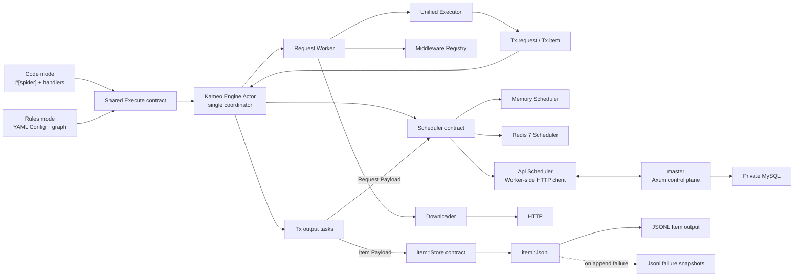
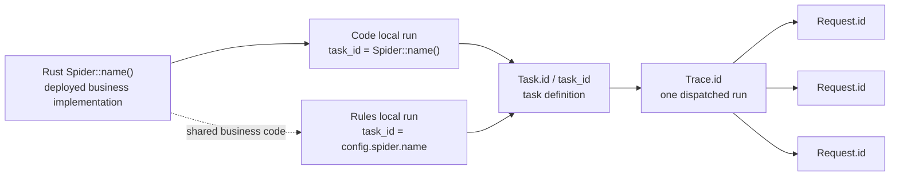
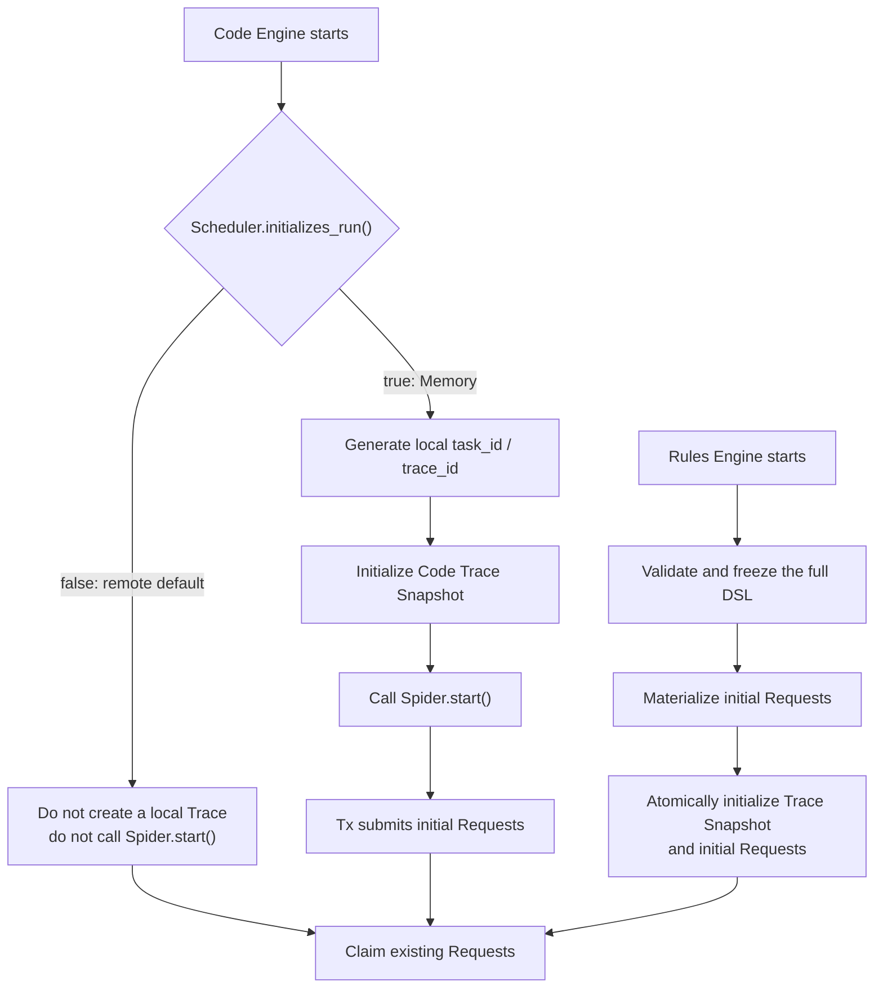
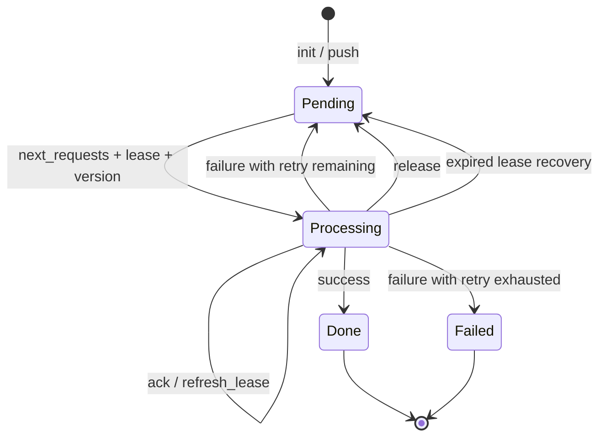
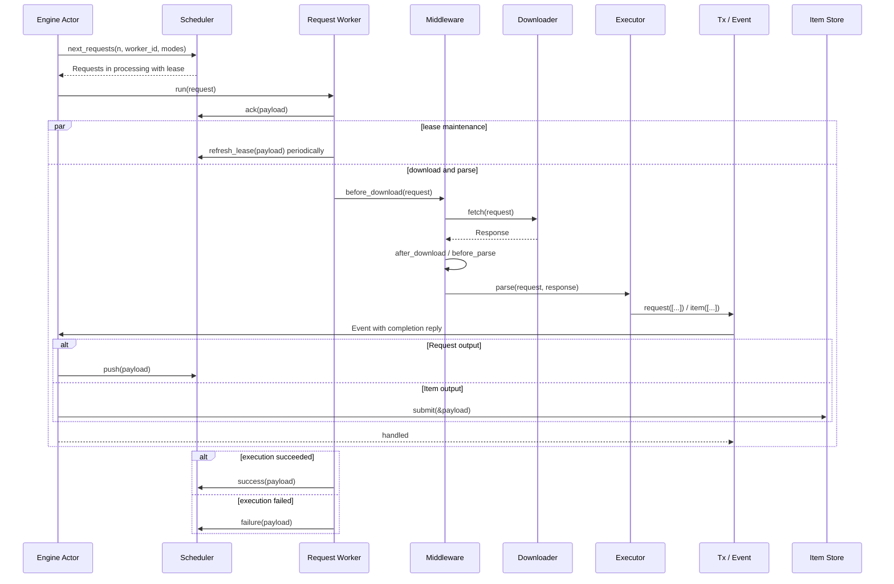

# crawler Architecture and Feature Overview

This document describes the features implemented by the current source tree, the core runtime model, and the extension boundaries. It is a standalone architecture overview.

## 1. Positioning and Current Scope

`crawler` is a Rust 2024 workspace. Its default runnable topology is a single-process asynchronous crawler runtime with the in-memory Scheduler and HTTP Downloader. `contrib` provides both a Redis 7 standalone Scheduler and the Worker-side HTTP API Scheduler for durable multi-Worker queues. The separate `master` crate is an Axum/MySQL control plane; it is not a Scheduler. Code mode and YAML Rules mode share the same Engine, Request, Response, Item, Middleware, Scheduler, and Payload objects. Rules mode is not a second runtime.

The workspace contains five crates:

| Crate | Responsibility |
| --- | --- |
| `spider` | Core runtime, public data objects, extension contracts, default Memory Scheduler, and HTTP Downloader |
| `macros` | The `#[spider]` procedural macro, including code-mode construction, node registration, and dispatch bindings |
| `contrib` | Replaceable external Scheduler implementations: Redis and Worker-side API are implemented |
| `examples` | Runnable code-mode and Rules-mode examples |
| `master` | Axum control plane with private MySQL storage, Task dispatch, Worker API, and control API |

### 1.1 Capability Status

| Capability | Status | Notes |
| --- | --- | --- |
| Code mode | Implemented | `#[spider]`, asynchronous handlers, `Tx.request`, and `Tx.item` |
| YAML Rules mode | Implemented | Validation, request graph, extraction, binding, transforms, Item Schema, and downstream Requests |
| Memory Scheduler | Implemented | Priority/FIFO queue, delayed Requests, leases, lease refresh, retry, terminal states, Traces, and statistics |
| HTTP Downloader | Implemented | Bounded decoded body, whole-fetch timeout, structured headers/cookies, redirects, proxy/TLS isolation, and bounded idle clients |
| Response charset decoding | Implemented | Deterministic BOM/header/HTML-meta/UTF-8 selection in `Response::text()` while preserving post-content-decoding bytes |
| Browser Downloader | Not implemented | The current stub returns `UnsupportedMode("browser")`; implementation is planned for v5 |
| CSS Selector | Implemented | `Response::css()` returns the native `scrape_core::Soup` |
| CSS Healing | Implemented | Deterministic whole-document candidate scoring after an exact CSS miss; opt-in only |
| Regex and JSON | Implemented | Regex selection and code-mode `Response::json<T>()` |
| AI Selector | Implemented | Explicit OpenAI-compatible JSON-object extraction, independent of CSS Healing |
| AI runtime configuration | Implemented | One reusable Worker-local `ai::OpenAI` provider is injected with `Engine::with_ai`; provider configuration does not enter Rules or Trace snapshots |
| Middleware | Implemented | Lifecycle Registry, Worker-local Memory implementations, and optional RedisBloom Dedup/shared Redis RateLimit implementations |
| Item Store | Implemented | Independent `open / close / submit(&Payload)` persistence contract; default JSONL output and Jsonl-owned failure snapshots; attachment download is planned for v5 |
| Capability-aware claiming | Implemented | Memory claims and checks pending work only within the current Worker's configured Request modes |
| Redis Scheduler | Implemented | Redis 7+ standalone only; namespaced complete Request Scheduler/Init contract and Lua-atomic transitions |
| API Scheduler | Implemented | `contrib::scheduler::api::Api` is the Worker-side HTTP Request Scheduler implementation; it preserves the complete Scheduler/Init contract through Master |
| Master control plane | Implemented | Separate Axum service with private MySQL 8.0.19+ storage, Task dispatch, and recovery; it does not implement Scheduler |
| Direct MySQL Scheduler | Out of scope | MySQL is Master-private control-plane storage; Workers use `Api`, never a direct MySQL Scheduler |
| Runtime tracing | Planned | v4 will use `fasttrace`; this is separate from the business `trace_id` |

XPath has been removed from the roadmap. CSS is the sole HTML selector path; the project does not maintain a partial XPath implementation.

## 2. Core Design Principles

1. **One runtime:** Code mode and Rules mode use one Executor. Trace Snapshot data selects the code handler or Rules interpretation path; only run-seed initialization differs.
2. **Scheduler as the Request distribution boundary:** Switching away from Memory changes only `.with_scheduler(...)` at assembly time. A replacement must implement the complete Request scheduling semantics, not merely wrap a storage client.
3. **Store as the Item persistence boundary:** `.with_store(...)` independently replaces Item persistence. A Store never claims, leases, or settles Requests.
4. **Immediate output:** Requests and Items emitted by parsing enter the Engine through `Tx` immediately. Request Payloads go to the Scheduler and Item Payloads go to the Store; neither waits for a Trace or request graph to finish.
5. **Identity is separate from execution ownership:** Request ID survives retry and recovery; `version`, `leased_by`, and `lease_time` describe one execution right.
6. **Immutable run snapshots:** Each Trace has one immutable Trace Snapshot. Rules snapshots contain the complete DSL; code snapshots never persist Rust handlers.
7. **Explicit recovery semantics:** Lease refresh, release, success, and failure use separate methods. There is no overloaded `finish` operation.
8. **Single-purpose modules:** The Actor coordinates, startup-frozen Worker state owns identity and capabilities, a Request task owns one execution right, an Executor parses, a Scheduler owns Request scheduling, and a Store owns Item persistence.

## 3. System Overview



The Engine uses one private Kameo Actor as its message-driven coordinator, but it does not force the Scheduler, Downloader, Executor, or AI selector into Actor types. Components retain method-based contracts. The Actor directly owns runtime state and dependencies; Request and output work still runs in independent Tokio tasks so no long I/O blocks message handling.

For the remote topology, `Api` is the only object in this diagram that enters
`Engine::with_scheduler(...)`. `master` remains outside Engine: it exposes the Worker API and a
separate control API, while its MySQL database is private control-plane storage. It does not
implement `scheduler::Scheduler`, and no Worker opens a database connection to claim or settle work.

## 4. Identity, Tasks, and Run Seeds

### 4.1 Identity Hierarchy



- Rust `Spider::name()` identifies the deployed business implementation. There is no duplicate `spider.id`.
- Rules `config.spider.name` identifies that Rules task and becomes its local `task_id`; it is not required to equal Rust `Spider::name()`.
- `Task.id` identifies a task definition. A persistent control plane may create several parameterized or scheduled Tasks from one deployed Spider.
- `Trace.id` identifies one Task run. Each periodic dispatch should create a new Trace.
- `Request.id` identifies one logical Request and remains unchanged across lease recovery and queue retry. For current-Request `Tx.request` output, the framework derives child IDs from the parent ID, the canonical initial child specification, and its occurrence in that parse attempt. Replaying the same output therefore reuses the ID; `Request::with_id` preserves an application-owned ID.
- Local Memory has no persistent Task table. A code run uses Rust `Spider::name()` as `task_id`; a Rules run uses `config.spider.name`.
- Item ID is not part of this hierarchy. `Tx.item` generates a UUID v7 when an Item has no ID. That ID identifies a data instance and does not provide business deduplication.

### 4.2 Run Seed

The logical input of one run is:

```text
task_id + trace_id + immutable Trace Snapshot + initial Requests
```

`Request::follow()` is a construction API, not a scheduling boundary. It may temporarily produce an
unbound Request with empty `task_id / trace_id`; the run-seed or current Tx context must bind both
before submission. `Scheduler::init` and `Scheduler::push` reject either identity when empty. From the
queued Request Snapshot onward, both identities and the referenced Trace Snapshot are mandatory.
Code mode is represented by a Trace Snapshot with no DSL, never by an absent Trace.

A Trace Snapshot holds run-level configuration shared by Requests: `task_id`, parameters, optional attachment configuration, persistence target, and priority. It has no schema version, Task revision, or derived Request-mode collection. A Rules Snapshot additionally contains the complete DSL, including its optional non-empty `spider.version` and valid IANA `spider.timezone`; a code Snapshot has an empty `dsl`.

A Request Snapshot stores its stable `node` and executable request fields. It never stores handlers, function pointers, closures, or process-local objects:

- Every Request restore resolves and attaches its Trace Snapshot through `trace_id`.
- A Rules Request additionally validates its node against the restored Trace DSL.
- A code Request still contains only a node name after restoration. The current Worker resolves that node through its local `#[spider]` registry.
- Claiming, retry, and recovery preserve the original Request `task_id / trace_id`; a Worker must not generate or overwrite them.

### 4.3 Current Startup Paths



`scheduler::Init::initializes_run()` currently controls code-mode local initialization. Memory returns `true`. A remote Scheduler defaults to `false`, so a code Worker can consume a run already published by an external task source without creating a local Trace or calling `Spider.start()`.

Rules mode treats the loaded YAML as the definition of this run. `rules::Init` validates and freezes
the configuration, materializes its initial Requests, and atomically stores them with the Trace
Snapshot. Run publication never executes Worker Middleware, `before_scheduler`, or Dedup. Middleware
stored on an initial Request remains available to its later lifecycle stages, but its
`before_scheduler` hook is not retroactively executed. Tx-produced Requests continue through the
normal admission path before `Scheduler::push`. External publishers preserve the same snapshot and
initial-Request contract without depending on Worker-local code.

## 5. Engine Actor

The outer `Runtime::start()` order is fixed:

```text
validate runtime limits
-> open Scheduler / Downloader / Item Store
-> before_spider
-> initialize or attach to a run
-> spawn and drain the Engine Actor
-> after_spider
-> close Downloader / Item Store / Scheduler
```

`Engine` in `engine/actor.rs` is the sole coordinator. It is a real Kameo Actor and owns:

- Executor startup, poll, and producer-idle observation task handles;
- at most one active Scheduler claim;
- the set of active Request tasks;
- the set of active Tx output tasks;
- Tx Event capacity, producer activity, and the first terminal error;
- shared Scheduler, Item Store, Downloader, Executor, and Middleware Registry references.

Startup, claim, Request, output, poll, and producer-idle completions return as separate Actor messages. Every spawned task catches panic and reports completion. An accepted output failure normally returns to its waiting `Tx` caller; if that caller has been cancelled, the output completion reports the undelivered error to the Engine instead of silently succeeding. Kameo's mailbox is unbounded for internal messages; the explicit Event capacity controls only external `Tx` output and therefore remains independent from internal completion traffic.

### 5.1 Three Independent Limits

| Setting | Default | Meaning |
| --- | ---: | --- |
| `with_concurrency(n)` | `16` | Maximum number of active Request tasks |
| `with_claim_limit(n)` | concurrency | Maximum Requests requested by one `next_requests(limit, worker_id, modes)` call |
| `with_event_limit(n)` | `32` | Maximum accepted Events whose Actor handler has not started |

The values are validated and frozen when the Engine starts. They are not hot-reloaded and do not replace one another. The actual claim size is:

```text
min(claim_limit, request_concurrency - active_request_tasks)
```

An Event permit is acquired before `Tx` sends an Event and released when the Engine Actor starts its handler. The handler registers an output task and delegates the reply; `Tx` still waits for Scheduler and Middleware processing to finish. Event capacity therefore bounds Events waiting to start, while the Actor's output task set separately prevents early shutdown during processing.

### 5.2 Idle Detection and Exit

An empty `next_requests(limit, worker_id, modes)` result means only that the current claim returned no work. It does not terminate the Engine. The Actor exits only when all of the following are true:

- the Scheduler confirms there are no queued or processing Requests within the current Worker capability scope;
- no startup, claim, poll, or producer-idle observation task is active;
- no Request task is active;
- no output task is active;
- no Event permit is active;
- no tracked Tx producer can still emit an Event.

An empty claim result is valid only for the work state observed by that claim. If a Request,
output Event, or Tx producer changes work while the claim is in flight, the Actor treats the
result as stale and claims again before it can terminate.

This prevents early termination while a list page is producing detail Requests, an Item Event arrives late, or a handler has cloned its Tx for delayed output.

## 6. Scheduler Contract and Memory Implementation

### 6.1 Scheduler Methods

| Method | Single responsibility |
| --- | --- |
| `lease` | Return optional lease timeout and refresh interval settings |
| `open / close` | Open and close Scheduler-owned resources |
| `push` | Consume only `Payload.requests`; skip identical replays, atomically insert missing Requests, and reject a conflicting collection |
| `trace` | Read an immutable Trace Snapshot by `trace_id` |
| `next_requests(limit, worker_id, modes)` | Atomically claim and restore at most `limit` Requests for the supplied Worker identity and modes |
| `has_pending_requests(worker_id, modes)` | Report whether the supplied Worker capability scope still has queued or processing Requests |
| `ack` | Confirm that the Engine accepted a claimed execution right |
| `release` | Voluntarily return execution ownership without consuming a queue retry |
| `refresh_lease` | Extend an acknowledged execution lease |
| `success` | Apply successful settlement and statistics only |
| `failure` | Apply failed settlement, statistics, and queue-level retry only |

`scheduler::Init` adds:

- `initializes_run()`, which declares whether this Engine creates a local run;
- `init(trace_id, snapshot, requests)`, which atomically stores a Trace Snapshot and its supplied initial Requests; an empty collection remains valid.

`Payload` remains the single transport envelope and the design does not add parallel Batch or Receipt structures. It carries Request execution identity, state, error, timing, statistics, and the `requests / items` output collections. Scheduler methods never persist Items: `push` accepts Requests only, while ownership and settlement Payloads require both collections to be empty. The independent `item::Store::submit(&Payload)` accepts Item Payloads and rejects Request or completion fields. A non-empty Item Payload always carries its run `task_id / trace_id`; a detached Tx may omit only Request execution identity.

For `has_pending_requests`, `modes` defines the capability scope. A processing Request with a matching mode remains pending for every Worker with that capability, regardless of its current `leased_by` value. The `worker_id` identifies and validates the caller; it does not narrow the processing set to leases owned by that Worker. This conservative rule prevents a compatible Worker from exiting before lease recovery or before an in-flight Request can emit more compatible work.

Every `contrib` Scheduler must fully implement these state and identity semantics. The Engine must not contain Redis-, MySQL-, or API-specific branches.

### 6.2 Memory State Model



Memory atomically maintains its queues, known Request IDs, processing records, acknowledgements, completions, Trace Snapshots, and Trace statistics behind one mutex:

- duplicate Request IDs within one Payload are rejected; replaying an existing ID with the same initial Request Snapshot is a no-op, while a different Snapshot conflicts and rejects the whole collection;
- a collection containing matching existing Snapshots and new Requests atomically inserts only the missing Requests;
- Memory keeps a SHA-256 digest of each canonical initial Request Snapshot for replay comparison; this is Scheduler identity protection, not URL/business deduplication;
- ID uniqueness prevents the same Request object from being enqueued twice; URL and business-field deduplication remain Dedup Middleware responsibilities;
- the ready queue uses higher `priority` first and FIFO within one priority; a delayed queue holds future `next_time` values;
- `Memory::new()` owns only process-local Scheduler state; Engine supplies a non-empty Worker ID and mode set for every claim and pending check;
- claim selects the highest-priority FIFO Request supported by the supplied mode set without changing incompatible queue entries, and pending checks use the same Worker scope;
- claiming changes a Request to `processing`, records `leased_by / lease_time`, and advances `version`;
- the default lease timeout is 30 seconds and the refresh interval is 10 seconds; `Memory::with_lease(...)` can replace them with positive whole-millisecond durations representable by the runtime clock;
- `ack` is idempotent for the same valid identity and records only execution confirmation; `refresh_lease` updates the acknowledged lease timestamp;
- an unacknowledged expired claim consumes no retry and records no failed Worker, while an acknowledged expiry appends the current Worker and consumes one queue attempt;
- recovery and retry return a Request to pending without changing `version`; the next successful claim creates the next execution generation;
- ordered duplicate-free `Request.failed_workers` is preserved and validated by the strict Request Snapshot contract;
- repeated `success / failure` with the same identity and terminal state is idempotent, while mismatched task, trace, node, worker, version, or state is rejected;
- `failure` preserves Request ID while advancing queue retry count, then requeues or enters failed when retries are exhausted.
- restoration, version/retry overflow, and queue-conversion failures produce explicit terminal diagnostics with the original Request ID instead of silently dropping work.

Memory is an unregistered process-local Scheduler. Engine owns the Worker identity and frozen mode
capabilities, then supplies them to each claim; Memory does not discover or select among a fleet of Workers;
registration, heartbeat, and cross-Worker eligibility belong to the concrete v4 contrib Scheduler or API control plane that needs them. It reads
Trace Snapshots from an immutable in-process map and has no remote cache, transport retry, or
temporary Trace-storage failure path. It does not restore its Request queue after process exit, and
the current implementation does not write local Request files under `data/requests/`.

### 6.3 Redis Implementation and Operations

`contrib::scheduler::redis::Redis` is a complete persistent implementation of the same `Scheduler`
and `Init` contract. It is not a Redis client wrapped by Engine: Redis itself owns immutable Trace
Snapshots, canonical Request replay identity, capability-scoped queue ordering, leases, acknowledgements,
release, refresh, settlement, retry, terminal records, and statistics. The Engine only switches its
Request scheduling dependency:

```rust
let scheduler = contrib::scheduler::redis::Redis::new("redis://127.0.0.1:6379")?
    .with_namespace("crawler")?;

let engine = spider::engine::Engine::new()
    .with_scheduler(scheduler)
    .with_spider(MySpider::new())
    .build();
```

`Redis::new` validates the connection URL and `with_namespace` validates the key namespace. Every
Redis key is scoped below that namespace, and `close()` drops only local client resources. It never
deletes persisted work; a new Scheduler instance using the same URL and namespace can continue it.
Redis returns `initializes_run() == false`, so a code-mode Worker consumes externally initialized
runs; explicit Rules `init` remains atomic and supported.

All state transitions that need shared atomicity execute in Redis Lua scripts. Claim atomically
recovers expired leases, selects compatible work in global priority/FIFO order, increments the
execution version, and establishes ownership using Redis server time. Init and Request replay also
remain all-or-nothing: a conflicting Request Snapshot rejects the whole collection, while an exact
replay is a no-op. Transient connection and availability failures remain `Scheduler::Unavailable`,
rather than being reclassified as ownership loss.

Active ownership has one mode-scoped projection: `processing:<mode>` is a ZSET whose member is the
opaque Request token and whose score is `lease_time`. It supports both capability-scoped pending
checks and expiration scans; there is no separate global lease index. The Request Hash is the source
of truth. A valid processing Hash repairs a stale score or wrong-mode projection without changing
retry state, while an invalid Hash is quarantined. Every transition clears both known mode
projections before publishing its single current membership when it changes active ownership.

Recurring maintenance is deliberately bounded under backlog: one `next_requests` invocation recovers
at most 64 expired leases from each mode and inspects at most 128 processing records across both
modes. The per-mode recovery share prevents equal Redis timestamps in one backlog from starving the
other mode. It promotes
and inspects at most 128 delayed Requests for each requested mode. Additional due entries remain
indexed for later claims rather than being dropped.
Failed-Worker eligibility has a separate `pending_exclusions:<mode>` ZSET containing only pending
Request/Worker pairs. Ready selection inspects at most 128 excluded members per invocation. Its local
cursor stores, for each mode, the latest inspected ready-event revision and the last excluded ready
member. Every ready-queue insertion, including requeue and delayed promotion, appends an event to the
mode-scoped `ready_events:<mode>` ZSET. Before continuing after the saved member, claim inspects later
events for that mode. A new ready member resets progress only when it sorts before the cursor and the
current Worker is eligible for it; lower-priority events and writes to another mode do not reset the
cursor. Removing the saved member restarts that mode from its head. If any requested mode still has an
unresolved higher-priority prefix, the claim yields temporarily instead of selecting a lower-priority
candidate from another mode. `has_pending_requests` compares the two queue sizes with the Worker's
lexicographically indexed exclusions; it therefore remains exact without an unbounded Lua scan.
When recovery, promotion, or ready-queue selection finds a missing record, it removes the dangling
index entry. A stale processing projection backed by a valid Hash is repaired; malformed Request or
queue state is quarantined by removing its active entries, recording a terminal failure and
completion, then continuing with later valid Requests. This does not hide shared-index corruption:
an invalid Redis type for a shared index rejects the claim before it mutates state. Ready-queue
cleanup is likewise bounded to 128 discarded invalid entries before the claim yields to a later
invocation. Claim returns the persisted digest with the immutable Request Snapshot; Rust recalculates
the canonical digest before overlaying mutable execution fields. A mismatch follows token-scoped
recovery and is never returned as executable work. When that digest is valid, its immutable retry
limit controls recovery and repairs a mismatched mutable Hash value. Recovery failure for one damaged
record does not withhold valid Requests already claimed in the same atomic operation; the damaged
record remains processing for normal lease-timeout recovery. Every Request Snapshot requires
`max_retry_count` in `1..=128`; the immutable Snapshot value controls recovery and bounds failed-Worker
history, while the mutable Hash cannot expand it. The current internal key layout does not migrate older
Redis namespaces.

The implementation targets one Redis 7+ standalone primary. It intentionally does not support
Redis Cluster, because its namespace spans several keys and its Lua transitions rely on
single-instance atomicity. Cluster is a future separate Scheduler design, not a connection flag.
Durable deployments must enable AOF (`appendonly yes`) and set `maxmemory-policy noeviction`.
`appendfsync` is deliberately an operator choice: `always` trades throughput and latency for a
smaller persistence window, while `everysec` commonly offers higher throughput with up to roughly
one second of acknowledged-write exposure. Operators must monitor Redis capacity independently of
the configured Item Store.

### 6.4 API Scheduler and Master Control Plane

`contrib::scheduler::api::Api` is a complete Worker-side implementation of `Scheduler` and `Init`.
It translates `open / close / push / trace / next_requests / has_pending_requests / ack /
release / refresh_lease / success / failure` to the Master Worker API, preserving the core Payload,
identity, capability, lease, retry, and terminal-state semantics. It owns an HTTP client, bounded
response reads, bounded outbound JSON serialization, operation keys where the remote operation
requires idempotency, a bounded immutable Trace cache, and Worker heartbeat tasks. Outbound retries
reuse one immutable byte buffer instead of serializing or cloning the full message again. It is not a
direct MySQL client and no Engine code has a Master-specific branch.

`master` is a separate Axum executable with private MySQL 8.0.19+ storage. It does not implement
`Scheduler`, cannot be passed to `Engine::with_scheduler(...)`, and never starts or stops Workers.
It owns the HTTP boundary, MySQL migrations, Task records, Trace Snapshots, Request state, Item
records, settlement history, Worker observations, and trace statistics. Its pool uses `READ COMMITTED`;
namespace and identity columns use binary `utf8mb4_0900_bin` collations so IDs and idempotency keys
remain byte-sensitive. A direct MySQL Scheduler is deliberately absent: a Worker connects only to
`Api`, while only Master holds database credentials.

The two API surfaces use separate bearer credentials and require the configured namespace:

| Surface | Credential | Responsibility |
| --- | --- | --- |
| Worker API | Worker token | Scheduler operations, Trace reads, claims, acknowledgements, lease refresh, settlement, heartbeat, and the independent Item ingestion endpoint |
| Control API | Control token | Task publication plus read-only Task, Trace, Request, Worker, and Item observation |

Master retains `POST /v1/worker/items` as an independent Item ingestion endpoint. The API Scheduler
does not call or implement that endpoint; a separately configured Store or client may target it
without changing Request scheduling. Keeping this endpoint does not make Master an Item-aware
Scheduler.

A Worker token cannot publish Tasks; a control token is not a Worker Scheduler credential. Credentials
and Master database URLs are Worker-local or control-plane deployment configuration and never enter
Rules, Trace Snapshots, Request Snapshots, Payloads, or Items.
Master extracts and validates the applicable credential and namespace from request parts before any
JSON or raw-body extractor runs. An unauthorized malformed or oversized body therefore returns the
authentication error first and cannot consume the body-processing path.
The Axum listener itself is plain HTTP. A production topology must terminate TLS at a trusted reverse
proxy or load balancer before this listener; bearer credentials are not safe over an untrusted
plaintext hop.

An API-backed Worker has a finite external lifecycle. `Api::open()` fetches and verifies the Master
lease policy and advertised response limit (64 MiB by default). `Api::with_max_response_bytes(...)`
sets the Worker's receive capacity before opening; Master sets its request/response limit with YAML
`api.max_size` or `master::Config::with_api(...)`. The YAML accepts human-readable sizes such as
`64MiB`; values must be between 1 KiB and 4 GiB minus one byte. Opening rejects a
Master limit larger than that local capacity, so 64 MiB is a default, not a fixed topology-wide limit. The first
claim or pending-work check registers the supplied `worker_id` and supported modes. Later calls only
rewrite that record when modes change or its heartbeat is stale, and heartbeat maintenance stops when
the Scheduler closes. Client connect, read, request, and aggregate retry
deadlines are bounded; response bodies are streamed into a bounded buffer. Its activity gate lets
`Api::close()` reject new calls and wait for calls already admitted before it stops heartbeat tasks
and clears Worker-local operation-key and Trace caches. The immutable Trace cache is bounded by both
128 entries and 64 MiB.

Claim and release create a fresh idempotency key for every public invocation; only HTTP retries inside
that invocation reuse it. Init retains one unresolved logical-operation key across the Engine's outer
retry in the same task. Definite success or a deterministic error clears that key; an unresolved key expires
exactly five minutes after its first creation rather than sliding on reuse, and the local store refuses
new keys at its 4096-entry bound instead of evicting a live operation. Master requires
`history.ttl >= max(lease_timeout, 5m30s)`, preserving persistent operation and completion
replay records beyond that client window. Without a current Tokio task identity, each Init call
uses a fresh key instead of entering this unresolved-operation store. If a successful `POST` response
exceeds the client bound, the result remains `Unavailable` rather than becoming a deterministic
failure; calls carrying an operation key retain it for replay.

Engine exits under its normal capability-scoped pending-work rules; Master only observes the
heartbeat and never supervises that Engine process. A missing heartbeat may trigger the same recovery
transition early, but lease expiry remains the universal recovery path.

Master Cron is control-plane maintenance, not a Worker supervisor. On each tick it:

1. recovers, through the same retry and terminal-state rules used by normal failure, expired leases
   and leases whose owning Worker is offline, up to the configured recovery limit;
2. dispatches up to the configured dispatch limit of due Tasks atomically by creating a fresh
   `trace_id`, immutable Trace Snapshot, and initial Requests, then advances a periodic Task or
   marks a one-shot Task complete;

Task publication performs only static Rules/code-seed and Snapshot validation. During dispatch,
Cron materializes the stored Rules or code seed and inserts it directly; it does not run a Worker's
`before_scheduler`, Middleware, or Dedup admission chain.
Dispatch attempts are bounded independently from the number of successful Traces. A deterministically
invalid stored Task is rolled back, rechecked under lock, and quarantined as `failed` with its error
visible through the control API; later due Tasks still run. Republishing a corrected definition clears
that error and makes the Task schedulable again. Database and other transient errors still fail the tick.

The control-plane retention duration and cleanup limit drive bounded cleanup of terminal Request,
completion, and operation history. Item, Trace, Task, and trace-stat retention remains a separate
follow-up rather than an implemented automatic purge. Master has no persisted Event/audit domain in
this release; one must be introduced only together with real transactionally recorded actions.

Every newly accepted Request receives a namespace-local monotonically increasing queue sequence.
Release, retryable failure, and lease recovery allocate a new sequence when they return a Request to
pending, so an old Request does not jump ahead of work accepted while it was executing. Recovery is
bounded and ordered. A Request at `i64::MAX` execution version is quarantined as failed instead of
remaining permanently unclaimable, and statistics rows are locked in stable name order.
Claim validates stored Requests and their Trace ownership before taking the lease timestamp, caches
Trace reads by `trace_id`, and measures the response incrementally. It reads at most 128 rows per
storage query and quarantines at most 128 invalid candidates in one call; later calls resume cleanup,
while valid candidates can continue across pages until the caller's limit or response capacity is
reached. All accepted Requests then receive one common lease start. A response embeds a Trace at most
once per `trace_id`; when `Request + Trace` does not fit but the Request alone does, it omits the Trace
and lets the Worker retrieve and cache it through the Trace endpoint. Only a Request that cannot fit by
itself is quarantined as oversized.

The control token exposes the following implemented surface. Lists return
`{"items":[...],"next_cursor":...}`, default to 50 rows, cap requests at 200 rows, and bind each
keyset cursor to its namespace, endpoint, and active filters. Summary rows omit large payloads.

| Route | Result |
| --- | --- |
| `PUT /v1/control/tasks/{task_id}` | Validate and publish one Rules or code-seed Task |
| `GET /v1/control/tasks[/{task_id}]` | Task summaries or definition detail |
| `GET /v1/control/traces[/{trace_id}]` | Trace summaries or Snapshot, stats, and Request counts |
| `GET /v1/control/requests[/{request_id}]` | Execution summaries or Snapshot, failed Workers, ack version, and latest completion |
| `GET /v1/control/workers` | Worker modes, heartbeat, and computed online state |
| `GET /v1/control/items[/{row_id}]` | Item summaries or data selected by the internal row identity |

This surface is observational except for Task publication. It does not provide start, stop, pause,
manual requeue, replay, or delete operations.

A Task contains either complete Rules DSL or serialized code Request seeds. Master never persists a
Rust handler; a code Worker resolves the stable node through its own deployed Spider registry.
`Api::initializes_run()` is `false`, so a remote code Worker does not create a local Trace or call
`Spider.start()`; it only claims Master-dispatched Requests. Browser downloading and `fasttrace`
runtime tracing remain separate future work and do not alter this boundary.

## 7. Complete Request Lifecycle



The important semantics are:

- `ack` happens before Downloader execution. A failed ack prevents the download.
- `release` returns unfinished ownership voluntarily; it is not failure and does not increment retry count.
- Lease maintenance covers download, parsing, and retries of final `success / failure` settlement.
- Immediately before each `next_requests` attempt, Engine records a monotonic `claim_started` and
  retains it only for a successful call. For every Request returned by that call, that instant plus
  the Scheduler timeout is its initial local lease deadline. Scheduler and network latency therefore
  consume part of this conservative budget; Engine never compares a Worker's wall clock with Scheduler
  server time. A successful refresh begins the next local deadline from its own monotonic start.
- Before a final Payload exists, explicit ownership loss, lease expiry, or another terminal refresh error cancels execution and prevents settlement. Transient refresh errors retry within the current lease deadline while execution continues.
- After execution produces an immutable final Payload, `success / failure` is authoritative. A concurrent refresh error stops further refreshes but cannot cancel settlement; transient settlement errors retry the same Payload without executing the Request again.
- Middleware Retry is a local Worker retry for downloading, parsing, or Item submission.
- Scheduler `failure` is the only queue-level Request retry. The Worker submits it only after local execution retries are exhausted.
- `Tx.request` and `Tx.item` wait for actual Event handling, so parsing cannot report success before the Scheduler or Item Store accepts the corresponding output.
- exhausted Item submission returns into the current parser call and causes the current Request to settle as failed.
- current-Request `Tx.request` output uses a fresh occurrence allocator for each parse attempt. The canonical output includes scheduling intent such as `next_time` and uses a time-stable Cookie view. Parse and queue retries reproduce the same IDs for the same canonical output, while identical outputs within one attempt remain distinct. Detached Tx output has no parent Request identity and retains at-least-once delivery.
- every emitted Request is checked as one collection against its Tx `task_id / trace_id` before any `before_scheduler` Middleware runs; a Middleware is not allowed to rewrite `id`, `task_id`, or `trace_id`. Because the replay-stable ID is derived before this hook, any hook that changes the remaining Request specification must be deterministic for the same input; time-, random-, or external-state-dependent changes intentionally surface as a Snapshot conflict on replay.
- `Response::follow` always inherits vals and Trace identity. A same-origin target clones the updated Headers and CookieStore; a cross-origin target drops source headers and retains only cookies applicable to the target URL.
- the HTTP Downloader validates every redirect target against `allowed_domains` before sending it. A disallowed redirect is a normal filter, not a download retry or `error_download`; an allowed cross-origin redirect drops source headers and retains only target-applicable cookies.
- every redirect applies all intermediate `Set-Cookie` values before the next hop. On a cross-origin hop, source headers are removed and the CookieStore is reduced to target-applicable cookies before sending.

Proxy and TLS are Request-level download settings. `Http` pools clients by the complete proxy URL
(including credentials) and `tls.accept_invalid_certs`; direct requests use a separate no-proxy key.
An entry can serve concurrent matching Requests, becomes idle after its last handle is released, and
is removed lazily after 90 idle seconds. The pool retains at most 64 idle Clients by default and evicts
the oldest idle entry under pressure. Active entries are never evicted and may temporarily exceed the
idle capacity; `Http::with_max_idle_clients` replaces the positive startup-frozen bound. `Http::close()`
clears the pool and invalidates concurrent cold-build insertion, so a client constructed before close
cannot be reattached afterward. Redirects for one Request retain that Request's selected client; proxy
or TLS configuration is never mutated as global Downloader state.

### 7.1 HTTP Transport Bounds and State

`Http` enforces a Worker-level decoded-body ceiling of 64 MiB by default.
`Http::with_max_body_bytes` replaces this positive startup setting. A code or Rules Request may set a
positive `max_body_bytes` no greater than the Worker ceiling; a value above that ceiling fails before
network I/O instead of being clamped. The Downloader consumes decoded chunks and counts their actual
bytes without preallocating the ceiling. An exact-limit body succeeds, while the first byte over the
limit terminates the stream with an explicit error. `Content-Length` may reject an obviously oversized
unencoded response early, but never overrides the actual decoded count.

`Request.timeout` is one monotonic budget for a complete `Http::fetch`: connection establishment, every
allowed redirect, and the final decoded body stream share one deadline. Redirects do not reset it. A
Middleware or Scheduler download retry invokes a new fetch and receives a fresh full budget; parse
retry reuses the existing Response and performs no download. The completed body remains the existing
bounded `Response.body: Bytes`; no public streaming Response, file sink, or attachment API is added.

The Downloader follows only `301`, `302`, `303`, `307`, and `308`. A redirect that changes a
body-bearing Request to GET discards the body and removes `Content-Length`, `Content-Type`,
`Content-Encoding`, `Content-Language`, `Content-Location`, and `Transfer-Encoding` on subsequent hops.
This cleanup also applies when the previous body value was empty but carried body metadata. An original GET or HEAD does not lose
those headers merely because of its method. Other 3xx responses, including `304`, are returned without
following `Location`.

`Headers` is a wrapper over `http::HeaderMap<HeaderValue>`. Names use standard case-insensitive identity,
Response values retain their raw bytes and received multiplicity, `set` replaces every value for a name,
and `append` preserves existing values. Rules Request headers remain a single-value map and therefore
apply through `set`. Request Snapshot serializes normalized names to non-empty arrays of string values;
a non-string Request value makes Snapshot creation fail. Response is not serialized and may retain raw
non-string values.

`Cookies` wraps `cookie_store::CookieStore`. A Request carries its complete lineage snapshot, the
Downloader selects only values applicable to each actual URL, and every response `Set-Cookie` updates
the store before business parsing. Domain, Path, Secure, Max-Age, and Expires behavior comes from the
standard store. `Response::follow` and Rules edge construction copy the updated store into descendants,
including Request Snapshot and cross-Worker recovery. Already queued siblings are immutable copies and
do not observe later mutations. Cross-origin construction removes source headers and reduces the copied
store to target-applicable cookies, preventing unrelated credentials from entering the new Snapshot;
cross-site public-suffix Domain attributes are rejected, while an identical public-suffix Request host
is normalized to HostOnly. Raw `Cookie` headers are removed before transport so CookieStore remains
the only session source. Memory replay comparison includes stored Cookie records through a dedicated
stable view. A `Max-Age` cookie keeps its raw relative attribute while omitting the absolute expiry
derived from the current receive time, so Request identity does not change when the same response is
replayed; explicit `Expires` and session state remain part of the view. The public `Cookies`
serializer, lookup, and transport still ignore expired records. Request Snapshot
serialization preserves those records so a later cross-Worker restore retains the same replay
identity. There is no Trace-wide live or distributed CookieStore.

### 7.2 Response Character Decoding

The v3 response charset contract keeps `Response.body` as the Downloader-delivered payload bytes
after HTTP content decoding and before character transcoding. `Response::text()` is the single decoding
boundary for CSS, Regex, AI, and JSON consumers. It selects the first recognized encoding in this order:

```text
recognized BOM
-> valid Content-Type charset
-> HTML meta in the first 1024 bytes when MIME is text/html or absent
-> UTF-8
```

The BOM is removed from returned text. Empty, malformed, or unknown charset labels fall through to
the next eligible source. Once selected, malformed byte sequences produce `U+FFFD`; they do not
trigger another encoding choice. No statistical detector or site-specific guess participates.
HTML meta follows web prescan rules: UTF-16 labels select UTF-8 and `x-user-defined` selects
Windows-1252; those adjustments do not alter BOM or HTTP-header selections.
`Response::json<T>()` decodes through `Response::text()` before deserialization. Deterministic local
HTTP fixtures provide required regression coverage; live Internet access is not a CI prerequisite.

Each Request execution owns one shared `stats::Delta`, accumulating `total / done / filter / dedup / validate / download` counters by node or `items`. A directly awaited Tx call uses the current task-local Request context and updates that delta. A Tx clone moved to a detached task retains only Trace identity; its output neither changes the settled Request nor delays settlement. The Worker attaches the delta snapshot to the final Payload, and the Scheduler merges it into Trace statistics only on the first `success / failure` settlement; idempotent replay does not double-count it.

## 8. Two Execution Modes

### 8.1 Code Mode

The `#[spider]` macro lets application code declare only Spider fields and asynchronous methods:

- `name` is the unique Spider name;
- `start_urls / start` emit initial Requests;
- `index` is the default node, and additional handler methods register stable nodes;
- handlers use `self.tx.request(Vec<Request>)` for downstream Requests;
- handlers use `self.tx.item(Vec<Item>)` for Items.

The macro generates input checks, construction, node registration, and handler call bindings only. The Engine state machine, Scheduler, Downloader, and Middleware do not live in the procedural macro.

### 8.2 Rules Mode

Rules loads task settings, a request graph, field extraction, bindings, transforms, complete downstream
Request Specs, and Item Schema from YAML. A Rules runtime still requires a Rust Spider through
`with_spider(...)`; the Spider provides shared business code and the concrete Item type. `with_rules(config)`
only creates one local Rules Trace seed. Omitting it creates code-mode work or consumes runs already present
in a remote Scheduler. The Rules task name is not required to equal `Spider::name()`.

`Config::validate()` performs complete static validation before execution, including start/target nodes,
Request transport, template context, reserved `idx`, and one-Item-edge-per-node constraints. Backends and APIs
can call the same validator before storing a configuration.

The unified Executor runs a Rules Request in this fixed order:

```text
Trace Snapshot.dsl = Some(config)
-> Rust Spider.index(response.clone())
-> Request.node
-> graph.nodes[node]
-> post-download field extraction
-> bind / transform / template
-> complete Request Specs and/or typed Rust Item construction
-> shared Tx and Scheduler paths
```

The Rust `index` call is the shared business-code entry for every Rules Request. Only after it
returns successfully does the same Executor interpret the declarative node. Code Requests instead
resolve their stable node directly through the Rust Spider registry.

`spider.start[*]` and request edges use the same complete Request Spec. Graph nodes contain parse, bind, and
domain policy only; they never fill transport fields after a Request has been created. URL-array expansion is
stable, writes a reserved one-based `vals.idx` before transport templates render, and resets the index for each
new expansion. Request and bind templates share one parser. Rendering walks the parsed source once, so braces
inside a resolved dynamic value remain literal data instead of becoming a second template expression.

Rules does not compile into a second Request or Item model. Parse/bind provides each base field and only a
non-empty Item-edge `vals` result overrides it; null, empty strings, arrays, and objects preserve the base while
zero and false remain valid overrides. Rules then builds the Spider's associated Rust Item through the derived
`Item::from_values`, assigns the current `SchemaKey`, and invokes the default `item` function or the edge's
configured `fn`. The business function submits with `Tx.item`, so Middleware and persistence remain shared.

Field extractors run in declaration order. An empty result falls through to the next extractor. The final result is collapsed by match count:

- zero matches: `null`, or `default`; a required field fails;
- one match: a scalar or element object;
- multiple matches: an array.

CSS expressions support `::text`, `::attr(name)`, and element output. An element object contains `html`, `text`, and `attrs`.

## 9. Selectors and Data Extraction

### 9.1 CSS and Healing

Code mode obtains the native Soup through:

```rust
let soup = response.css()?;
let nodes = soup.select("article h2")?;
```

Application code uses `Tag::text()`, `Tag::outer_html()`, and `Tag::get(...)` directly. The framework does not add another node wrapper around Soup.

The shared Healing entry point is `selector::css::select(&soup, expr, &config)`. Its flow is fixed:

```text
compile valid CSS
-> exact selection
-> return exact matches immediately
-> on an exact miss with explicit healing, scan every DOM element
-> score only constraints declared by the CSS AST
-> return all highest-scoring nodes at or above min in DOM order
```

Scoring covers tags, IDs, classes, attributes, combinator relationships, and supported static pseudo-classes. Extra candidate attributes are not penalized. The default `min` is `0.8`, and the valid range is `0.0..=1.0`.
Recursive relationship scoring memoizes each `(DOM node, selector compound)` state for one selection.
Best-ancestor and best-earlier-sibling states reuse the immediately related node, so deep descendant
and wide sibling chains require linear relation states rather than repeated full-chain scans. No state
is persisted across documents.

Healing accepts exactly the syntax that `scrape-core 0.2.9` can compile. In particular, that parser currently rejects `:is()`, `:where()`, and `:has()` before Healing starts.

Healing stores no historical fingerprints, does not rewrite or persist a repaired selector, does not cross selector types, and never calls AI. Invalid CSS returns a CSS error. A score below `min` returns an empty set so Rules can continue to the next extractor for that field.

### 9.2 Regex, JSON, and AI

- Regex returns every capture. It uses capture group one when present, otherwise the full match.
- `Response::json<T>()` follows the shared response-text decoding contract before deserialization.
- AI is an explicit selector alongside CSS and Regex. A Rules AI extractor contains only `kind: ai` and its non-empty `expr`; the prompt describes the expected object fields, while provider configuration is not part of the DSL.
- The application resolves `base_url`, `api_key`, and `model_name` from its chosen configuration or secret source, constructs one `ai::OpenAI`, and injects it through `Engine::with_ai`. Crawler does not read these values from environment variables. `ai::OpenAI` owns one reusable `async-openai` client for an OpenAI-compatible Chat Completion endpoint.
- The unified Executor attaches the shared provider to each Response immediately before parsing. Code handlers and Rules both call `response.ai(expr).await`; Response clones share it through a crate-private field. Provider configuration is non-serializable and omitted from Response Debug output.
- Provider settings and credentials never enter Rules, Trace Snapshot, Request, Payload, Scheduler, or Item data. `base_url` must be an absolute HTTP(S) base endpoint without user information, a query, or a fragment. `OpenAI` Debug may identify that validated endpoint and model, but never the key; provider failures omit request URLs and raw response content.
- Local Rules assembly rejects an AI extractor without a configured provider. A remotely restored Rules Trace fails explicitly when it reaches AI on a Worker without a provider; this is not converted into a Scheduler capability or fallback.
- Every call requests `response_format=json_object` and appends the same mandatory object-only output instruction. Runtime parsing rejects arrays, scalars, Markdown, and prose. The Response body buffer is limited to 1 MiB before character-set decoding; the complete UTF-8 prompt, including `expr`, the fixed constraint, and decoded content, independently must fit within 1 MiB. The provider HTTP body is streamed through a 4 MiB bound after HTTP content decoding and before `async-openai` can buffer it. A provider attempt times out after 60 seconds and does not add a retry layer outside `error_parse`.
- `ai::OpenAI` uses an explicit private provider configuration that never reads `async-openai` environment defaults, validates the Authorization header during construction, suppresses dependency logging of raw error bodies, and maps provider failures to bounded classifications so response content cannot enter Scheduler error storage.
- AI availability is not part of capability-aware claiming. Every Worker that can claim Requests from the same task pool whose Rules can reach AI must use an equivalent provider endpoint and model; credentials remain Worker-local.
- AI does not generate CSS, and CSS Healing never delegates candidates to AI.

### 9.3 Media Fields

Rules `image / video / audio` values are processing types, not validator types. After extraction and before Item Schema validation, the framework normalizes URLs, strings, or HTML element objects into arrays whose entries contain:

```text
name, url, src, width, height, size, ext, alt
```

Relative URLs are resolved against the current Response URL, and duplicate normalized `url` values are removed within the field. The original `src` remains metadata and is not the deduplication key. Plain text fields are not media-normalized.

## 10. Middleware Lifecycle

The currently connected hooks are:

```text
before_spider
before_scheduler
before_download
after_download
before_parse
before_item
error_download
error_parse
error_item
after_spider
```

`Middleware::Next<T>` contains only `Continue(T)` and `Skip`. `Skip` is normal filtering and does not invoke the corresponding error hook. The Registry merges default Specs with object-local Specs, then orders them by `order` and declaration sequence.

Request middleware may change only fields owned by its stage. `before_scheduler` must preserve
`id / task_id / trace_id / node`; after a Request is claimed, `before_download` must also preserve `node` so
execution and lease settlement cannot refer to different work. `before_download` may still change
transport fields such as URL and headers.

Built-in implementations:

| Middleware | Hook area | Semantics |
| --- | --- | --- |
| `validate` | Default normal hooks | Validate Request/Response invariants and validate Items through validator using `SchemaKey` |
| `dedup` | `before_scheduler` | Scope Request membership by `task_id + node` and hash only explicitly configured ordered values |
| `rate_limit` | `before_download` | Limit downloads by one total QPS schedule per group |
| `retry` | Error configuration | Provide Worker-local retry policies for download, parse, and Item submission |

`Builder::with_middleware(name, value)` registers a capability; it does not attach it to every object. Request, Response, Item, and Spider lifecycle Specs opt into capabilities explicitly. Only validate Specs for the normal stages are Registry defaults.

Default validation requires a text Request body declaration to contain string `data`. A custom
Downloader Response must have an absolute HTTP(S) URL with a host and a valid HTTP status code;
`after_download` validates that structure, while `before_parse` retains the separate policy of skipping
non-success responses.

One effective Dedup Spec defines one rule with flat `args.key / normalize / ttl`; nested
`args.rules` is rejected. The bucket is `(task_id, node)`, and the item is
`sha256(canonical_json(ordered configured values))`. Canonicalization recursively sorts object keys
while preserving array order, path order, JSON types, and duplicate values. `trace_id`, Middleware
name, `Spec.key`, Rules names, and an implicit URL are excluded. `Spec.key` remains only a Registry
merge/skip identity. `dont_filter` bypasses configuration evaluation and storage.

The default `dedup::Memory` is an exact Worker-local store. It calculates any finite deadline before
locking, then atomically checks and inserts one structured `(task_id, node, item)` key. Omitted TTL
or `-1` lasts for the process lifetime, `0` bypasses lookup and write, and a positive integer is
milliseconds. Runtime Tx Request output runs this admission before `Scheduler::push`; Rules run seeds
are published directly through `Scheduler::init` and never consume Dedup membership.

`contrib::middleware::dedup::Redis` uses one RedisBloom filter per encoded `task_id + node` bucket.
Its synchronous constructor validates the Redis URL and the implementation creates its
`ConnectionManager` lazily. Each check uses
`BF.INSERT ... ERROR ... CAPACITY ... ITEMS` to atomically create or reuse the filter and add the
canonical item; `capacity` must be positive and `0.0 < error_rate < 1.0`. False positives are
accepted. The key has no configurable namespace. RedisBloom supports permanent membership and the
`ttl: 0` bypass; a positive finite TTL is rejected rather than emulated with an exact Set or rotating
time buckets. The first Worker that creates a bucket fixes the filter's actual options, so every
Worker sharing that `task_id + node` bucket must use equivalent options.

Each RateLimit group fixes one interval while it is active. A later Spec using the same group with a
different QPS fails immediately as invalid configuration rather than waiting behind the group's delay.
The default `rate_limit::Memory` owns a Worker-local schedule and removes an inactive group lazily.
`contrib::middleware::rate_limit::Redis` instead uses Redis server time and one atomic shared
reservation schedule per group across Workers. The Redis key derives only from the explicit group or,
when omitted, the Request URL host; it never includes task or Worker identity. Different intervals are
rejected while future reservations remain and may replace the schedule only after it has elapsed.

## 11. Items, Validation, and Persistence

The Item path is fixed:

```text
Tx.item
-> generate UUID v7 when ID is empty
-> before_item
-> item::Store::submit(&Payload)
-> success, or retry according to error_item policy
-> on exhaustion notify every Item through best-effort error_item and fail the current Request with the original Store error
```

Every concrete Item owns one explicit `#[serde(skip)] item::State`, rejects unknown serde fields, and derives
`serde::Serialize`, `serde::Deserialize`, and `macros::Item`. The Item derive generates `state / state_mut` and
the mandatory `Item::from_values` Rules construction boundary; code-mode Items continue using normal Rust constructors.
Additional Rules Item functions are explicitly marked with `#[item]`, and local Builder assembly rejects a missing
function before runtime initialization. The Schema Store computes a stable SHA-256 key from the canonicalized schema, caches a
`validator::Validator`, and validates the serialized Item. Item ID is outside the schema and does not participate
in business deduplication.

`item::Store` has exactly three responsibilities:

| Method | Single responsibility |
| --- | --- |
| `open` | Open Store-owned resources before Engine execution |
| `close` | Flush and close Store-owned resources during Engine shutdown |
| `submit(&Payload)` | Validate and persist one complete Item Payload; reject Request or settlement fields before backend mutation |

Engine uses `item::Jsonl::new()` by default. `.with_store(store)` replaces only Item persistence, while
`.with_scheduler(scheduler)` independently replaces Request scheduling. A Store receives the existing
Payload, including its task, trace, Request, and Worker identity, and may choose its own storage model;
it never reads, claims, leases, or settles Scheduler work.

`Jsonl::new()` uses the current working directory. `Jsonl::with_dir(path)` changes its output root:

```text
<dir>/data/items/output/<task_id>/<yyyy-mm-dd-HH>.jsonl
```

Each Item is one JSON line with the stable shape `{"id":"...","data":{...}}`. The framework Item ID is
stored beside, not injected into, the business serialization. Jsonl serializes the complete Payload before
taking the hourly file's append lock. Concurrent submissions to that file are serialized; a successful append
is flushed immediately. A write or flush failure is logged and returned without a transaction or file rollback;
complete or partial bytes already written by the backend may remain, and Engine retries the unchanged Payload
under at-least-once semantics. `close()` flushes all open files again. The file cache holds at most 64 paths.
When every cached handle is currently in use, another path is opened for that submission without entering the
cache. A separate fixed set of path-sharded locks preserves same-path write serialization regardless of cache state.

Jsonl owns its submission-failure snapshots:

```text
<dir>/data/items/snapshots/<task_id>/<yyyy-mm-dd-HH>/<content-sha256>-<submission-sha256>.json
```

- an append failure attempts to create one snapshot for that complete Item Payload before returning the original error to Engine retry;
- the snapshot includes Payload identity, the `id / data` records, the Store error, and failure time;
- a uniquely named temporary file is flushed and atomically renamed, so a failed snapshot write publishes no partial file;
- snapshot-write failure is logged and does not replace the original submission failure;
- the snapshot hour is frozen for one successful `Jsonl::open()` lifecycle, so retries crossing a wall-clock hour still address the original path;
- canonical Payload content and a random Jsonl open-session identity form the filename; a restart cannot treat an old filename as a live association;
- equal immutable Payload projections inside one open lifecycle may share only this recovery snapshot because their manual-recovery data is identical; every Store call still reaches output and no Item deduplication occurs;
- bounded sharded locks order output, snapshot publication, and cleanup for the same process-local projection;
- a later successful retry of the same immutable Payload projection removes the snapshot, while cleanup failure does not change Item success;
- an exhausted snapshot remains for manual handling; automatic replay is not currently implemented;
- a custom Store owns its own failure persistence and does not receive framework snapshots from the Scheduler.

Item submission is at-least-once. Business Item deduplication is downstream business logic outside
the Store contract.

## 12. Source Responsibilities

| Path | Single responsibility |
| --- | --- |
| `spider/src/engine/actor.rs` | Own Engine Actor state and the shared transition/termination decision |
| `spider/src/engine/actor/start.rs` | Start Executor work and handle its completion message |
| `spider/src/engine/actor/claim.rs` | Claim Scheduler work and handle its completion message |
| `spider/src/engine/actor/request.rs` | Register one Request task and handle its completion message |
| `spider/src/engine/actor/output.rs` | Accept Tx Events, delegate replies, and track output completion |
| `spider/src/engine/actor/wait.rs` | Schedule poll and producer-idle notifications |
| `spider/src/engine/actor/task.rs` | Own task handles and convert task panic into Engine errors |
| `spider/src/engine/builder.rs` | Assemble components and own the Schema Store used by all execution modes |
| `spider/src/engine/runtime.rs` | Component lifecycle, startup settings, and Actor assembly |
| `spider/src/engine/worker.rs` | Own the startup-frozen Worker ID and download-mode capabilities |
| `spider/src/engine/request/task.rs` | Ack, lease maintenance, and final settlement for one Request |
| `spider/src/engine/admission.rs` | Apply `before_scheduler` to Request output before it enters the Scheduler |
| `spider/src/engine/request.rs` | Download, Middleware, Worker-local retry, and parse lifecycle for one claimed Request |
| `spider/src/engine/event/request.rs` | Handle Request output emitted by Tx |
| `spider/src/engine/event/item.rs` | Run Item middleware, Store retries, and `error_item` orchestration |
| `spider/src/spider/tx/identity.rs` | Derive replay-stable IDs for current-Request output |
| `spider/src/engine/executor.rs` | Select Code/Rules from Trace Snapshot and invoke the shared Spider |
| `spider/src/engine/code.rs` | Code-mode local run-seed initialization |
| `spider/src/engine/rules.rs` | Rules-mode assembly and run-seed initialization |
| `spider/src/engine/rules/executor.rs` | Coordinate one Rules node execution and emit its outputs |
| `spider/src/engine/rules/executor/field.rs` | Extract declared fields from the current Response |
| `spider/src/engine/rules/executor/value.rs` | Resolve typed value references from the current Rules context |
| `spider/src/engine/rules/executor/bind.rs` | Evaluate ordered bind pipelines, transforms, and templates |
| `spider/src/engine/rules/executor/condition.rs` | Evaluate one edge condition |
| `spider/src/engine/rules/executor/build.rs` | Construct Request and Item values from an enabled edge |
| `spider/src/middleware/registry.rs` | Register and resolve Middleware implementations and Specs only |
| `spider/src/downloader/http.rs` | Execute HTTP requests, redirects, headers, cookies, and response conversion |
| `spider/src/downloader/http/pool.rs` | Key, reuse, expire, and close proxy/TLS-specific HTTP clients |
| `spider/src/net/request/contract.rs` | Public Request, mode, state, proxy, and TLS contract |
| `spider/src/payload/contract.rs` | Unified transport Payload and operation-specific structural validation |
| `spider/src/item/store.rs` | Public Item persistence contract |
| `spider/src/item/jsonl.rs` | Default Jsonl Store lifecycle and submission flow |
| `spider/src/item/jsonl/output.rs` | Hourly JSONL files, bounded handle cache, serialized appends, flush, and error logging |
| `spider/src/item/jsonl/snapshot.rs` | Process-local failure-snapshot projection, ordered publication, and cleanup |
| `spider/src/scheduler/contract.rs` | Public Scheduler contract |
| `spider/src/scheduler/init.rs` | Run-seed initialization contract |
| `spider/src/scheduler/memory.rs` | Public Memory implementation and submodule composition |
| `spider/src/net/request/digest.rs` | Canonically hash initial Request Snapshots for replay comparison; shared by Memory and Redis |
| `spider/src/scheduler/memory/claim.rs` | Coordinate one capability-aware claim from queued Snapshot to processing Request |
| `spider/src/scheduler/memory/queue.rs` | Ready/delayed queue ordering |
| `spider/src/scheduler/memory/reclaim.rs` | Recover expired acknowledged and unacknowledged leases |
| `spider/src/scheduler/memory/restore.rs` | Restore claimed Request Snapshots and handle restoration retries |
| `spider/src/scheduler/memory/settle.rs` | Identity checks, settlement, and queue retry |
| `spider/src/scheduler/memory/state.rs` | Memory runtime state structures |
| `spider/src/scheduler/memory/validate.rs` | Validate new Requests and their Trace ownership |
| `spider/src/selector/css/healing.rs` | Healing configuration and orchestration |
| `spider/src/selector/css/healing/reference.rs` | CSS AST to scoring reference model |
| `spider/src/selector/css/healing/score.rs` | DOM candidate traversal, relationships, and scoring |
| `spider/src/ai.rs` | Public AI runtime entry and `OpenAI` export |
| `spider/src/ai/openai.rs` | Validate provider configuration, own the reusable provider and execute model calls |
| `spider/src/ai/transport.rs` | Execute one provider request and bound its HTTP-decoded body before dependency buffering |
| `spider/src/error/ai.rs` | AI provider construction and call errors |
| `spider/src/selector/ai.rs` | Build prompts from Responses and enforce the JSON-object extraction contract |
| `spider/src/middleware/dedup/{config,fingerprint,memory}.rs` | Parse flat Dedup configuration, derive canonical bucket/items, and maintain exact Worker-local membership |
| `spider/src/middleware/rate_limit/{config,memory}.rs` | Parse group/QPS configuration and maintain Worker-local schedules |
| `macros/src/spider/expand.rs` | Expand the user Spider struct into its factory |
| `macros/src/spider/check.rs` | Validate macro input constraints |
| `macros/src/spider/bind.rs` | Generate node registration and handler bindings |
| `contrib/src/scheduler/redis/contract.rs` | Redis public type, lifecycle, and Scheduler/Init contract wiring |
| `contrib/src/scheduler/redis/request.rs` | Redis Trace/Request storage, claim, restore, and lease recovery |
| `contrib/src/scheduler/redis/settle.rs` | Redis acknowledgement, release, refresh, success, and failure transitions |
| `contrib/src/scheduler/redis/{key,script,validate,error}.rs` | Key isolation, Lua loading, boundary validation, and error mapping |
| `contrib/src/middleware/connection.rs` | Lazily establish and share one Redis ConnectionManager per Middleware instance |
| `contrib/src/middleware/dedup.rs` | RedisBloom options, bucket keys, and atomic `BF.INSERT` Dedup |
| `contrib/src/middleware/rate_limit.rs` and `rate_limit/reserve.lua` | Redis server-time shared group reservations and idle cleanup |
| `contrib/src/scheduler/api/{contract,client,request,settle,worker,state,wire}.rs` | Worker-side API Scheduler contract mapping, lifecycle, bounded HTTP transport, Trace cache, heartbeat, and wire data |
| `contrib/src/scheduler/api/client/response.rs` | Bound streamed Master responses and map transport-size failures |
| `contrib/src/scheduler/api/request/{claim,init,trace}.rs` | Map claims, run initialization, and immutable Trace reads to the Worker API |
| `master/src/server.rs` | Own the Axum server lifecycle and start/stop Cron with the service |
| `master/src/server/cron.rs` | Coordinate bounded Cron recovery, dispatch, and cleanup store operations |
| `master/etc/master-api.yaml` | Strict standalone Master runtime configuration template |
| `master/src/config.rs` and `master/src/config/file.rs` | Programmatic configuration, validation, and strict YAML runtime loading |
| `master/src/svc.rs` | Shared service Context containing validated Config and private MySQL dependencies |
| `master/src/types.rs` and `master/src/types/*.rs` | Unified Worker/control DTOs, Task seeds, pagination, filters, and cursor contracts |
| `master/src/handler.rs` and `master/src/handler/*.rs` | Axum route composition, extraction/authentication, HTTP response handling, and resource handlers |
| `master/src/logic.rs` and `master/src/logic/*.rs` | Resource business operations between HTTP handlers and the private store |
| `master/src/store/mysql/task.rs` | Static validation and Request materialization for Task/code-seed types defined in `master/src/types/task.rs` |
| `master/src/store/mysql/task/{write,dispatch}.rs` | Task persistence, bounded Cron seed dispatch, and deterministic invalid-Task quarantine |
| `master/src/store/mysql/request/{claim,lease,queue,recover,settle}.rs` | Request claiming, ownership transitions, FIFO allocation, bounded recovery, and settlement |
| `master/src/store/mysql/observe.rs` and `master/src/store/mysql/observe/{task,trace,request,worker,item}.rs` | Read-only Task, Trace, Request, Worker, and Item projections |
| `master/src/store/mysql/{task,request,trace,item,worker,operation,validate,time}.rs` | Private MySQL domain entry points, idempotency, validation, and time helpers |

Names rely on module context. For example, `request::State`, `memory::State`, and `registry::Bind` do not repeat their module names. Files likewise avoid mixing unrelated parsing, storage, and control-plane responsibilities.

## 13. Extension Boundaries and Roadmap

### Release Boundaries

- v3: capability-scoped atomic Scheduler claiming; deterministic response charset decoding and broader fixture-backed page regression coverage. These contracts are implemented.
- v4: the shared backend-neutral Scheduler conformance suite, the Redis 7 standalone Scheduler, RedisBloom Dedup, shared Redis RateLimit, Engine-level Worker-local `ai::OpenAI` provider injection, Worker-side API Scheduler, and Axum/MySQL Master control plane are implemented. A direct MySQL Scheduler and `fasttrace` runtime tracing remain separate work. The API Scheduler and Master depend on the core Scheduler contract, not on Browser delivery.
- v5: a real Browser Downloader plus mixed HTTP/browser end-to-end Engine acceptance, and a separate Item attachment downloader. Attachment downloading and Browser downloading are independent deliverables. Capability-aware claim semantics remain the v3 contract.

These capabilities must preserve the existing core contracts:

- replacing the Scheduler must not change the business shape of Engine, Spider, Downloader, Middleware, Request, Response, or Item;
- Redis and API Scheduler implementations must provide atomic claims, leases, lease refresh, version validation, retry, terminal states, and Trace reads themselves; every lease-backed implementation must recover expired leases even while the Worker is online, while offline-Worker recovery can only trigger that transition earlier;
- replacing the Item Store must not change Request scheduling, leasing, or settlement, and replacing the Scheduler must not replace or reconfigure the Store;
- Master is a control plane, not a Scheduler: only `Api` crosses the Engine Scheduler boundary, Worker and control credentials remain distinct, and Master-private MySQL is never exposed to Workers;
- Worker capability filtering must be atomic with the Scheduler claim, rather than claiming an incompatible Request and dropping it in the Downloader;
- Browser must implement the existing `Download` contract and produce the same `Response` model;
- `fasttrace` span context is operational telemetry and must not replace business `task_id / trace_id`.

### Explicit Non-Goals Today

- persisting or automatically updating historical CSS Healing fingerprints;
- invoking AI automatically from Healing;
- providing a partial XPath implementation;
- batching an entire Trace's Items at Engine shutdown;
- using Item ID for business deduplication;
- supporting Redis Cluster through the standalone Redis Scheduler; Cluster needs a separate Scheduler design;
- providing a direct MySQL Scheduler or direct Worker access to Master storage;
- automatically purging Master Item, Trace, Task, or trace-stat history; current bounded cleanup covers terminal Requests, completions, and operations;
- downloading Item attachments; that capability is unimplemented and assigned to an independent v5 change;
- making the core `spider` crate depend on `contrib` or a control-plane implementation.

## 14. Architecture Invariants

Implementation and extensions should continue to satisfy these checks:

1. A Request has at most one valid execution right at a time; settlement by an old version or Worker is rejected.
2. Request retry preserves `id / task_id / trace_id / node / version`, advances retry state, and lets the next successful claim advance the execution generation.
3. Neither code nor Rules serializes Rust handlers. A code Worker invokes its local registry by stable node only.
4. `Tx.request / Tx.item` output is handled immediately, and the Engine cannot exit while any producer can still emit work.
5. `success`, `failure`, `release`, and `refresh_lease` each express exactly one state transition semantic.
6. CSS Healing and AI remain independent and explicit selection capabilities.
7. Character decoding never mutates `Response.body`, and every response text consumer uses the same deterministic decoding path.
8. `master` is never passed to Engine as a Scheduler; only `contrib::scheduler::api::Api` is the remote Scheduler boundary, and Worker/control credentials cannot substitute for each other.
9. Planned components are never presented as implemented merely because placeholder files or configuration fields exist.

## 15. Related Documentation

- [Architecture document index](./架构设计文档.md)
- [中文架构总览](./architecture.zh-CN.md)
