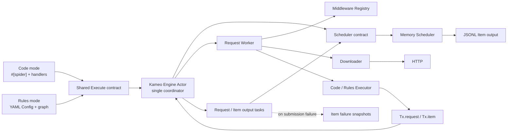
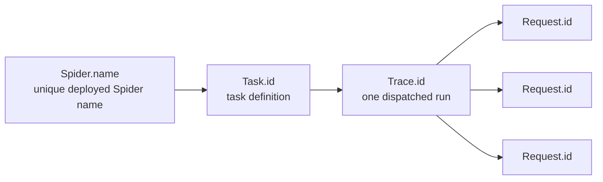
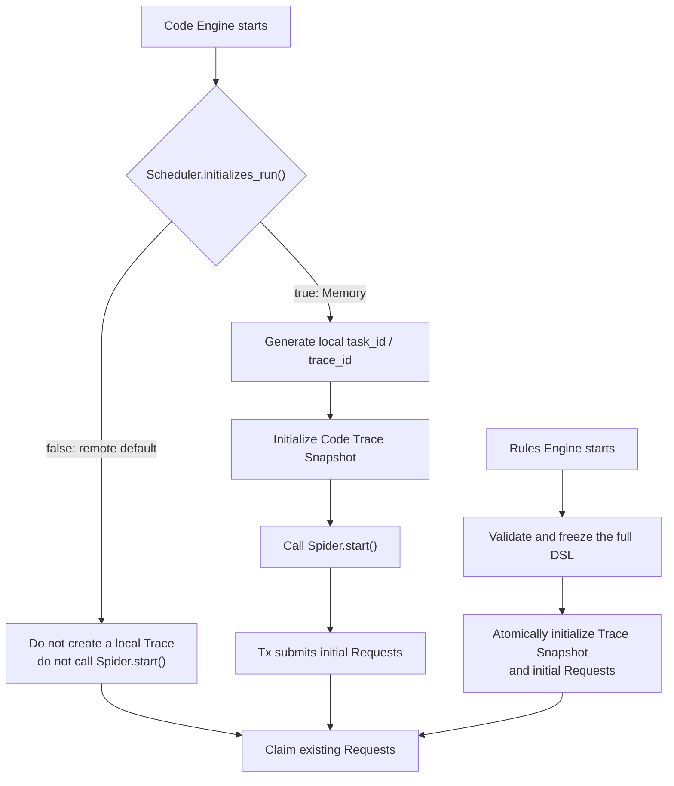
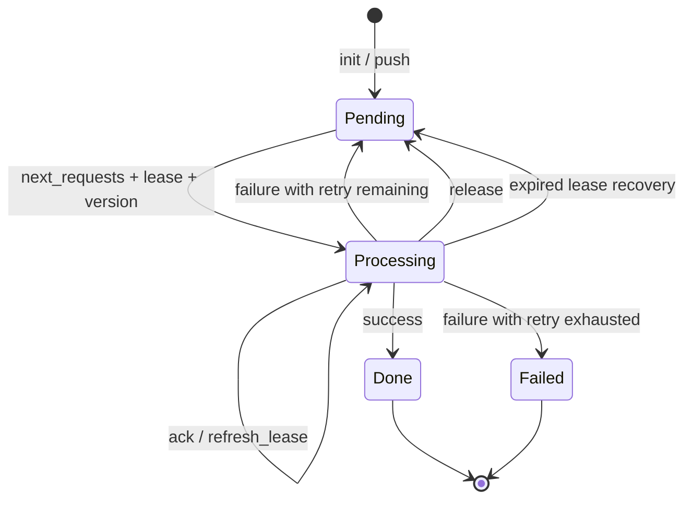
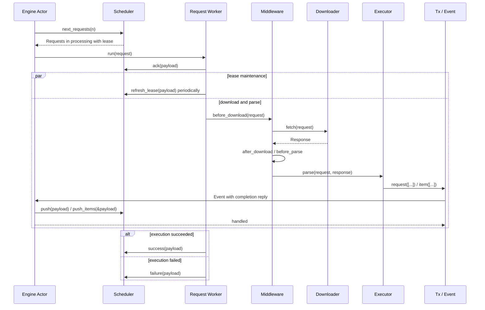

# crawler Architecture and Feature Overview

This document describes the features implemented by the current source tree, the core runtime model, and the extension boundaries. It is a standalone architecture overview.

## 1. Positioning and Current Scope

`crawler` is a Rust 2024 workspace. Its currently runnable topology is a single-process asynchronous crawler runtime with the in-memory Scheduler and HTTP Downloader by default. Code mode and YAML Rules mode share the same Engine, Request, Response, Item, Middleware, Scheduler, and Payload objects. Rules mode is not a second runtime.

The workspace contains four crates:

| Crate | Responsibility |
| --- | --- |
| `spider` | Core runtime, public data objects, extension contracts, default Memory Scheduler, and HTTP Downloader |
| `macros` | The `#[spider]` procedural macro, including code-mode construction, node registration, and dispatch bindings |
| `contrib` | Boundary for replaceable external Schedulers; the API, Redis, and MySQL modules are currently placeholders |
| `examples` | Runnable code-mode and Rules-mode examples |

### 1.1 Capability Status

| Capability | Status | Notes |
| --- | --- | --- |
| Code mode | Implemented | `#[spider]`, asynchronous handlers, `Tx.request`, and `Tx.item` |
| YAML Rules mode | Implemented | Validation, request graph, extraction, binding, transforms, Item Schema, and downstream Requests |
| Memory Scheduler | Implemented | Priority/FIFO queue, delayed Requests, leases, lease refresh, retry, terminal states, Traces, and statistics |
| HTTP Downloader | Implemented | Headers, cookies, body, timeout, redirects, proxy, and TLS settings |
| Browser Downloader | Not implemented | The current stub returns `UnsupportedMode("browser")`; implementation is planned for v5 |
| CSS Selector | Implemented | `Response::css()` returns the native `scrape_core::Soup` |
| CSS Healing | Implemented | Deterministic whole-document candidate scoring after an exact CSS miss; opt-in only |
| Regex and JSON | Implemented | Regex selection and code-mode `Response::json<T>()` |
| AI Selector | Implemented | Explicit OpenAI-compatible JSON extraction, independent of CSS Healing |
| Middleware | Implemented | Lifecycle Registry plus built-in validate, dedup, rate limit, and retry capabilities |
| Item output | Implemented | Schema validation, media normalization, JSONL output, and submission-failure snapshots |
| Capability-aware claiming | Planned | The v3 OpenSpec is not implemented; current claims do not filter by Request `mode` |
| API/Redis/MySQL Schedulers | Planned | v4 `contrib` capabilities; each must implement the complete Scheduler contract |
| Master control plane | Planned | A v4 capability, not part of the core Scheduler itself |
| Runtime tracing | Planned | v4 will use `fasttrace`; this is separate from the business `trace_id` |

XPath has been removed from the roadmap. CSS is the sole HTML selector path; the project does not maintain a partial XPath implementation.

## 2. Core Design Principles

1. **One runtime:** Code mode and Rules mode replace only the Executor and initialization logic. Scheduling, downloading, Middleware, Events, and settlement remain shared.
2. **Scheduler as the distribution boundary:** Switching away from Memory changes only `.with_scheduler(...)` at assembly time. A replacement must implement the complete scheduling semantics, not merely wrap a storage client.
3. **Immediate output:** Requests and Items emitted by parsing enter the Engine through `Tx` immediately. They are not held until a Trace or request graph finishes.
4. **Identity is separate from execution ownership:** Request ID survives retry and recovery; `version`, `leased_by`, and `lease_time` describe one execution right.
5. **Immutable run snapshots:** Each Trace has one immutable Trace Snapshot. Rules snapshots contain the complete DSL; code snapshots never persist Rust handlers.
6. **Explicit recovery semantics:** Lease refresh, release, success, and failure use separate methods. There is no overloaded `finish` operation.
7. **Single-purpose modules:** The Actor coordinates, a Worker owns one Request execution, an Executor parses, and a Scheduler implements scheduling and submission contracts.

## 3. System Overview



The Engine uses one private Kameo Actor as its message-driven coordinator, but it does not force the Scheduler, Downloader, Executor, or AI selector into Actor types. Components retain method-based contracts. The Actor directly owns runtime state and dependencies; Request and output work still runs in independent Tokio tasks so no long I/O blocks message handling.

## 4. Identity, Tasks, and Run Seeds

### 4.1 Identity Hierarchy



- `Spider.name` is the sole Spider identifier in code and Rules mode. There is no duplicate `spider.id`.
- `Task.id` identifies a task definition. A persistent control plane may create several parameterized or scheduled Tasks from one deployed Spider.
- `Trace.id` identifies one Task run. Each periodic dispatch should create a new Trace.
- `Request.id` identifies one logical Request and remains unchanged across lease recovery and queue retry.
- Local Memory has no persistent Task table, so it uses `Spider.name` as its local `task_id`.
- Item ID is not part of this hierarchy. `Tx.item` generates a UUID v7 when an Item has no ID. That ID identifies a data instance and does not provide business deduplication.

### 4.2 Run Seed

The logical input of one run is:

```text
task_id + trace_id + immutable Trace Snapshot + initial Requests
```

A Trace Snapshot holds run-level configuration shared by Requests: `task_id`, parameters, optional attachment configuration, persistence target, and priority. It has no schema version, Task revision, or derived Request-mode collection. A Rules Snapshot additionally contains the complete DSL, including its optional non-empty `spider.version` and valid IANA `spider.timezone`; a code Snapshot has an empty `dsl`.

A Request Snapshot stores its stable `node` and executable request fields. It never stores handlers, function pointers, closures, or process-local objects:

- A Rules Request is restored by obtaining the Trace DSL through `trace_id` and validating its node against that DSL.
- A code Request still contains only a node name after restoration. The current Worker resolves that node through its local `#[spider]` registry.
- Claiming, retry, and recovery preserve the original Request `task_id / trace_id`; a Worker must not generate or overwrite them.

### 4.3 Current Startup Paths



`scheduler::Init::initializes_run()` currently controls code-mode local initialization. Memory returns `true`. A remote Scheduler defaults to `false`, so a code Worker can consume a run already published by an external task source without creating a local Trace or calling `Spider.start()`.

Rules mode currently treats the loaded YAML as the definition of this run. Before claiming starts, `rules::Init` atomically stores its Trace Snapshot and initial Requests. A future externally dispatched Rules worker must preserve this snapshot contract instead of introducing a second identity model in the Worker.

## 5. Engine Actor

The outer `Runtime::start()` order is fixed:

```text
validate runtime limits
-> open Scheduler / Downloader / local snapshot directory
-> before_spider
-> initialize or attach to a run
-> spawn and drain the Engine Actor
-> after_spider
-> close Downloader / Scheduler
```

`Engine` in `engine/actor.rs` is the sole coordinator. It is a real Kameo Actor and owns:

- Executor startup, poll, and producer-idle observation task handles;
- at most one active Scheduler claim;
- the set of active Request tasks;
- the set of active Tx output tasks;
- Tx Event capacity, producer activity, and the first terminal error;
- shared Scheduler, Downloader, Executor, Middleware Registry, and optional Item snapshot store references.

Startup, claim, Request, output, poll, and producer-idle completions return as separate Actor messages. Every spawned task catches panic and reports completion. Kameo's mailbox is unbounded for internal messages; the explicit Event capacity controls only external `Tx` output and therefore remains independent from internal completion traffic.

### 5.1 Three Independent Limits

| Setting | Default | Meaning |
| --- | ---: | --- |
| `with_concurrency(n)` | `16` | Maximum number of active Request tasks |
| `with_limit(n)` | concurrency | Maximum Requests requested by one `next_requests(limit)` call |
| `with_event_limit(n)` | `32` | Maximum accepted Events whose Actor handler has not started |

The values are validated and frozen when the Engine starts. They are not hot-reloaded and do not replace one another. The actual claim size is:

```text
min(claim_limit, request_concurrency - active_request_tasks)
```

An Event permit is acquired before `Tx` sends an Event and released when the Engine Actor starts its handler. The handler registers an output task and delegates the reply; `Tx` still waits for Scheduler and Middleware processing to finish. Event capacity therefore bounds Events waiting to start, while the Actor's output task set separately prevents early shutdown during processing.

### 5.2 Idle Detection and Exit

An empty `next_requests(limit)` result means only that the current claim returned no work. It does not terminate the Engine. The Actor exits only when all of the following are true:

- the Scheduler confirms there are no queued or processing Requests;
- no startup, claim, poll, or producer-idle observation task is active;
- no Request task is active;
- no output task is active;
- no Event permit is active;
- no tracked Tx producer can still emit an Event.

An empty claim result is valid only for the work state observed by that claim. If a Request,
output Event, or Tx producer changes work while the claim is in flight, the Actor treats the
result as stale and claims again before it can terminate.

This prevents early termination while a list page is producing detail Requests, an Item Event arrives late, or a handler has cloned its Tx for delayed output.

## 6. Scheduler Contract and Memory Implementation

### 6.1 Scheduler Methods

| Method | Single responsibility |
| --- | --- |
| `dir` | Return an optional Worker-local directory used for framework Item failure snapshots |
| `lease` | Return optional lease timeout and refresh interval settings |
| `open / close` | Open and close Scheduler-owned resources |
| `push` | Consume only `Payload.requests` and submit emitted Requests |
| `push_items` | Consume only `Payload.items` and submit Items |
| `trace` | Read an immutable Trace Snapshot by `trace_id` |
| `next_requests(limit)` | Claim and restore at most `limit` Requests |
| `has_pending_requests` | Report whether the Scheduler scope still has queued or processing Requests |
| `ack` | Confirm that the Engine accepted a claimed execution right |
| `release` | Voluntarily return execution ownership without consuming a queue retry |
| `refresh_lease` | Extend an acknowledged execution lease |
| `success` | Apply successful settlement and statistics only |
| `failure` | Apply failed settlement, statistics, and queue-level retry only |

`scheduler::Init` adds:

- `initializes_run()`, which declares whether this Engine creates a local run;
- `init(trace_id, snapshot, requests)`, which atomically stores a Trace Snapshot and its initial Requests.

`Payload` is the single transport envelope shared by these methods; the design does not add parallel Batch or Receipt structures. It carries Request execution identity, state, error, timing, statistics, and the `requests / items` output collections. Every Scheduler method rejects fields unrelated to its own semantics: `push` accepts Requests only, `push_items` accepts Items only, and settlement Payloads require both collections to be empty.

Every `contrib` Scheduler must fully implement these state and identity semantics. The Engine must not contain Redis-, MySQL-, or API-specific branches.

### 6.2 Memory State Model



Memory atomically maintains its queues, known Request IDs, processing records, acknowledgements, completions, Trace Snapshots, and Trace statistics behind one mutex:

- duplicate Request IDs within one Payload and IDs already registered by Memory are rejected;
- ID uniqueness prevents the same Request object from being enqueued twice; URL and business-field deduplication remain Dedup Middleware responsibilities;
- the ready queue uses higher `priority` first and FIFO within one priority; a delayed queue holds future `next_time` values;
- claiming changes a Request to `processing`, records `leased_by / lease_time`, and advances `version`;
- the default lease timeout is 30 seconds and the refresh interval is 10 seconds; `Memory::with_lease(...)` can replace them;
- `ack` is idempotent for the same valid identity and records only execution confirmation; `refresh_lease` updates the acknowledged lease timestamp;
- an unacknowledged expired claim consumes no retry and records no failed Worker, while an acknowledged expiry appends the current Worker and consumes one queue attempt;
- recovery and retry return a Request to pending without changing `version`; the next successful claim creates the next execution generation;
- ordered duplicate-free `Request.failed_workers` is preserved and validated by the strict Request Snapshot contract;
- repeated `success / failure` with the same identity and terminal state is idempotent, while mismatched task, trace, node, worker, version, or state is rejected;
- `failure` preserves Request ID while advancing queue retry count, then requeues or enters failed when retries are exhausted.
- restoration, version/retry overflow, and queue-conversion failures produce explicit terminal diagnostics with the original Request ID instead of silently dropping work.

Memory is an unregistered process-local Scheduler and does not perform fleet-aware Worker selection; registration, heartbeat, and cross-Worker eligibility belong to v4 contrib Schedulers. It reads Trace Snapshots from an immutable in-process map and has no remote cache, transport retry, or temporary Trace-storage failure path. It does not restore its Request queue after process exit, and the current implementation does not write local Request files under `data/requests/`.

## 7. Complete Request Lifecycle



The important semantics are:

- `ack` happens before Downloader execution. A failed ack prevents the download.
- `release` returns unfinished ownership voluntarily; it is not failure and does not increment retry count.
- lease maintenance covers download, parsing, and retries of final `success / failure` settlement.
- Middleware Retry is a local Worker retry for downloading, parsing, or Item submission.
- Scheduler `failure` is the only queue-level Request retry. The Worker submits it only after local execution retries are exhausted.
- `Tx.request` and `Tx.item` wait for actual Event handling, so parsing cannot report success before the Scheduler accepts its output.
- exhausted Item submission returns into the current parser call and causes the current Request to settle as failed.
- `Response::follow` always inherits vals and Trace identity, but inherits headers and cookies only for a same-origin target.
- the HTTP Downloader validates every redirect target against `allowed_domains` before sending it. A disallowed redirect is a normal filter, not a download retry or `error_download`; an allowed cross-origin redirect inherits no headers or cookies.
- same-origin redirects apply intermediate `Set-Cookie` values to the next hop; those accumulated credentials are discarded before a cross-origin hop.

Each Request execution owns one shared `stats::Delta`, accumulating `total / done / filter / dedup / validate / download` counters by node or `items`. A directly awaited Tx call uses the current task-local Request context and updates that delta. A Tx clone moved to a detached task retains only Trace identity; its output neither changes the settled Request nor delays settlement. The Worker attaches the delta snapshot to the final Payload, and the Scheduler merges it into Trace statistics only on the first `success / failure` settlement; idempotent replay does not double-count it.

## 8. Two Execution Modes

### 8.1 Code Mode

The `#[spider]` macro lets application code declare only Spider fields and asynchronous methods:

- `name` is the unique Spider name;
- `start_urls / start` emit initial Requests;
- `index` is the default node, and additional handler methods register stable nodes;
- handlers use `self.tx.request(Vec<Request>)` for downstream Requests;
- handlers use `self.tx.item(Vec<Item>)` for Items.

The macro generates input checks, construction, node registration, and handler call bindings only. The Engine state machine, Scheduler, Downloader, and Middleware do not live in the procedural macro.

### 8.2 Rules Mode

Rules loads task settings, a request graph, field extraction, bindings, transforms, complete downstream
Request Specs, and Item Schema from YAML. A Rules runtime still requires a Rust Spider through
`with_spider(...)`; the Spider provides shared business code and the concrete Item type. `with_rules(config)`
only creates one local Rules Trace seed. Omitting it creates code-mode work or consumes runs already present
in a remote Scheduler. The Rules task name is not required to equal `Spider::name()`.

`Config::validate()` performs complete static validation before execution, including start/target nodes,
Request transport, template context, reserved `idx`, and one-Item-edge-per-node constraints. Backends and APIs
can call the same validator before storing a configuration.

The Rules Executor interprets only the current node:

```text
Trace Snapshot.dsl = Some(config)
-> Request.node
-> graph.nodes[node]
-> post-download field extraction
-> bind / transform / template
-> complete Request Specs and/or typed Rust Item construction
-> shared Tx and Scheduler paths
```

`spider.start[*]` and request edges use the same complete Request Spec. Graph nodes contain parse, bind, and
domain policy only; they never fill transport fields after a Request has been created. URL-array expansion is
stable, writes a reserved one-based `vals.idx` before transport templates render, and resets the index for each
new expansion.

Rules does not compile into a second Request or Item model. It builds the Spider's associated Rust Item through
`Item::from_values`, assigns the current `SchemaKey`, and invokes the default `item` function or the edge's
configured `fn`. The business function submits with `Tx.item`, so Middleware and persistence remain shared.

Field extractors run in declaration order. An empty result falls through to the next extractor. The final result is collapsed by match count:

- zero matches: `null`, or `default`; a required field fails;
- one match: a scalar or element object;
- multiple matches: an array.

CSS expressions support `::text`, `::attr(name)`, and element output. An element object contains `html`, `text`, and `attrs`.

## 9. Selectors and Data Extraction

### 9.1 CSS and Healing

Code mode obtains the native Soup through:

```rust
let soup = response.css()?;
let nodes = soup.select("article h2")?;
```

Application code uses `Tag::text()`, `Tag::outer_html()`, and `Tag::get(...)` directly. The framework does not add another node wrapper around Soup.

The shared Healing entry point is `selector::css::select(&soup, expr, &config)`. Its flow is fixed:

```text
compile valid CSS
-> exact selection
-> return exact matches immediately
-> on an exact miss with explicit healing, scan every DOM element
-> score only constraints declared by the CSS AST
-> return all highest-scoring nodes at or above min in DOM order
```

Scoring covers tags, IDs, classes, attributes, combinator relationships, and supported static pseudo-classes. Extra candidate attributes are not penalized. The default `min` is `0.8`, and the valid range is `0.0..=1.0`.

Healing accepts exactly the syntax that `scrape-core 0.2.9` can compile. In particular, that parser currently rejects `:is()`, `:where()`, and `:has()` before Healing starts.

Healing stores no historical fingerprints, does not rewrite or persist a repaired selector, does not cross selector types, and never calls AI. Invalid CSS returns a CSS error. A score below `min` returns an empty set so Rules can continue to the next extractor for that field.

### 9.2 Regex, JSON, and AI

- Regex returns every capture. It uses capture group one when present, otherwise the full match.
- `Response::json<T>()` deserializes structured JSON directly from the response body.
- AI is an explicit selector alongside CSS and Regex. It uses `async-openai` with an OpenAI-compatible Chat Completion endpoint, combines the current Response text with `expr`, and parses the model content as one JSON value.
- Persisted Rules configuration must reference an API key as `env:VARIABLE`; the Worker resolves the secret at execution time. Temporary code-created configuration may accept a direct key, but serialization rejects direct secrets.
- AI does not generate CSS, and CSS Healing never delegates candidates to AI.

### 9.3 Media Fields

Rules `image / video / audio` values are processing types, not validator types. After extraction and before Item Schema validation, the framework normalizes URLs, strings, or HTML element objects into arrays whose entries contain:

```text
name, url, src, width, height, size, ext, alt
```

Relative URLs are resolved against the current Response URL, and duplicate `src` values are removed within the field. Plain text fields are not media-normalized.

## 10. Middleware Lifecycle

The currently connected hooks are:

```text
before_spider
before_scheduler
before_download
after_download
before_parse
before_item
error_download
error_parse
error_item
after_spider
```

`Middleware::Next<T>` contains only `Continue(T)` and `Skip`. `Skip` is normal filtering and does not invoke the corresponding error hook. The Registry merges default Specs with object-local Specs, then orders them by `order` and declaration sequence.

Built-in implementations:

| Middleware | Hook area | Semantics |
| --- | --- | --- |
| `validate` | Default normal hooks | Validate Request/Response invariants and validate Items through validator using `SchemaKey` |
| `dedup` | `before_scheduler` | Build Request fingerprints from configured fields; omitted or `-1` TTL never expires |
| `rate_limit` | `before_download` | Limit downloads by group and QPS |
| `retry` | Error configuration | Provide Worker-local retry policies for download, parse, and Item submission |

`Builder::with_middleware(name, value)` registers a capability; it does not attach it to every object. Request, Response, Item, and Spider lifecycle Specs opt into capabilities explicitly. Only validate Specs for the normal stages are Registry defaults.

Default Dedup handles only Request fingerprints built from explicitly configured keys; it never deduplicates Items or adds an implicit URL key. Its exact in-memory store uses a `HashMap` plus an expiry heap and lazily removes only expired heap-head entries. `ttl: 0` retains nothing; omitted TTL or `-1` remains for the process lifetime without capacity eviction.

## 11. Items, Validation, and Local Persistence

The Item path is fixed:

```text
Tx.item
-> generate UUID v7 when ID is empty
-> before_item
-> Scheduler.push_items(&Payload)
-> success, or retry according to error_item policy
-> on exhaustion call error_item and fail the current Request
```

Every concrete Item owns one non-serialized `item::State` and implements `state / state_mut` plus the mandatory
`Item::from_values` Rules construction boundary; code-mode Items can continue using normal Rust constructors.
Additional Rules Item functions are explicitly marked with `#[item]`, and local Builder assembly rejects a missing
function before runtime initialization. The Schema Store computes a stable SHA-256 key from the canonicalized schema, caches a
`validator::Validator`, and validates the serialized Item. Item ID is outside the schema and does not participate
in business deduplication.

Memory uses the current working directory by default. `Memory::with_dir(path)` changes the root of both normal output and failure snapshots.

Normal Item output:

```text
<dir>/data/items/output/<task_id>/<yyyy-mm-dd-HH>.jsonl
```

Each Item is one JSON line containing only its business serialization. Concurrent writes to the same hourly file are serialized. A failed append attempts to roll back that append, and `close()` flushes open files.

`version / timezone` are Trace-level runtime metadata. A persistent Scheduler may read the
corresponding Trace Snapshot through `payload.trace_id` during `push_items` and denormalize
them into its own Item record. The column names are `config_version` and `timezone`; plain
`version` remains reserved for Request execution ownership. These fields are not automatically
injected into business Item JSON or copied into every Request Snapshot, and the default Memory
JSONL does not store them.

Submission-failure snapshots:

```text
<dir>/data/items/snapshots/<task_id>/<yyyy-mm-dd-HH>/<uuid-v7>.json
```

- the first `push_items` failure attempts to create a snapshot before continuing configured retries;
- snapshot-write failure does not prevent Scheduler retries;
- a later successful retry removes the snapshot, while cleanup failure does not change Item success;
- an exhausted snapshot remains for manual handling; automatic replay is not currently implemented;
- another Scheduler enables framework-local snapshots only when its `dir()` returns a local path.

Item submission is at-least-once. Business Item deduplication belongs downstream or in a custom Scheduler's Item submission implementation.

## 12. Source Responsibilities

| Path | Single responsibility |
| --- | --- |
| `spider/src/engine/actor.rs` | Own Engine Actor state and the shared transition/termination decision |
| `spider/src/engine/actor/start.rs` | Start Executor work and handle its completion message |
| `spider/src/engine/actor/claim.rs` | Claim Scheduler work and handle its completion message |
| `spider/src/engine/actor/request.rs` | Register one Request task and handle its completion message |
| `spider/src/engine/actor/output.rs` | Accept Tx Events, delegate replies, and track output completion |
| `spider/src/engine/actor/wait.rs` | Schedule poll and producer-idle notifications |
| `spider/src/engine/actor/task.rs` | Own task handles and convert task panic into Engine errors |
| `spider/src/engine/runtime.rs` | Component lifecycle, startup settings, and Actor assembly |
| `spider/src/engine/worker.rs` | Ack, lease maintenance, and final settlement for one Request |
| `spider/src/engine/request.rs` | Download, Middleware, Worker-local retry, and parse path |
| `spider/src/engine/event/request.rs` | Handle Request output emitted by Tx |
| `spider/src/engine/event/item.rs` | Handle Items, submission retries, and failure snapshots |
| `spider/src/engine/executor.rs` | Select Code/Rules from Trace Snapshot and invoke the shared Spider |
| `spider/src/engine/code.rs` | Code-mode local run-seed initialization |
| `spider/src/engine/rules.rs` | Rules-mode assembly and run-seed initialization |
| `spider/src/engine/rules/executor.rs` | Coordinate one Rules node execution and emit its outputs |
| `spider/src/engine/rules/executor/field.rs` | Extract declared fields from the current Response |
| `spider/src/engine/rules/executor/value.rs` | Resolve typed value references from the current Rules context |
| `spider/src/engine/rules/executor/bind.rs` | Evaluate ordered bind pipelines, transforms, and templates |
| `spider/src/engine/rules/executor/condition.rs` | Evaluate one edge condition |
| `spider/src/engine/rules/executor/build.rs` | Construct Request and Item values from an enabled edge |
| `spider/src/scheduler/contract.rs` | Public Scheduler contract |
| `spider/src/scheduler/init.rs` | Run-seed initialization contract |
| `spider/src/scheduler/memory.rs` | Public Memory implementation and submodule composition |
| `spider/src/scheduler/memory/claim.rs` | Claiming, expired-lease recovery, and Request restoration |
| `spider/src/scheduler/memory/queue.rs` | Ready/delayed queue ordering |
| `spider/src/scheduler/memory/settle.rs` | Identity checks, settlement, and queue retry |
| `spider/src/scheduler/memory/state.rs` | Memory runtime state structures |
| `spider/src/selector/css/healing.rs` | Healing configuration and orchestration |
| `spider/src/selector/css/healing/reference.rs` | CSS AST to scoring reference model |
| `spider/src/selector/css/healing/score.rs` | DOM candidate traversal, relationships, and scoring |
| `macros/src/spider/model.rs` | Parse the user Spider model and methods |
| `macros/src/spider/check.rs` | Validate macro input constraints |
| `macros/src/spider/bind.rs` | Generate node registration and handler bindings |
| `contrib/src/scheduler/*` | Boundary for future external Scheduler implementations |

Names rely on module context. For example, `request::State`, `memory::State`, and `registry::Bind` do not repeat their module names. Files likewise avoid mixing unrelated parsing, storage, and control-plane responsibilities.

## 13. Extension Boundaries and Roadmap

### Not Yet Implemented

- v3: atomic Scheduler claiming by Worker capability; HTTP charset handling and broader real-page regression coverage.
- v4: API, Redis, and MySQL Schedulers; Master control plane; auditable Item snapshot replay; `fasttrace` runtime tracing.
- v5: a real Browser Downloader and mixed HTTP/Browser Worker capabilities.

These capabilities must preserve the existing core contracts:

- replacing the Scheduler must not change the business shape of Engine, Spider, Downloader, Middleware, Request, Response, or Item;
- API/Redis/MySQL implementations must provide atomic claims, leases, lease refresh, version validation, retry, terminal states, Trace reads, and Item submission themselves;
- Worker capability filtering must be atomic with the Scheduler claim, rather than claiming an incompatible Request and dropping it in the Downloader;
- Browser must implement the existing `Download` contract and produce the same `Response` model;
- `fasttrace` span context is operational telemetry and must not replace business `task_id / trace_id`.

### Explicit Non-Goals Today

- persisting or automatically updating historical CSS Healing fingerprints;
- invoking AI automatically from Healing;
- providing a partial XPath implementation;
- batching an entire Trace's Items at Engine shutdown;
- using Item ID for business deduplication;
- making the core `spider` crate depend on `contrib` or a control-plane implementation.

## 14. Architecture Invariants

Implementation and extensions should continue to satisfy these checks:

1. A Request has at most one valid execution right at a time; settlement by an old version or Worker is rejected.
2. Request retry preserves `id / task_id / trace_id / node / version`, advances retry state, and lets the next successful claim advance the execution generation.
3. Neither code nor Rules serializes Rust handlers. A code Worker invokes its local registry by stable node only.
4. `Tx.request / Tx.item` output is handled immediately, and the Engine cannot exit while any producer can still emit work.
5. `success`, `failure`, `release`, and `refresh_lease` each express exactly one state transition semantic.
6. CSS Healing and AI remain independent and explicit selection capabilities.
7. Planned components are never presented as implemented merely because placeholder files or configuration fields exist.

## 15. Related Documentation

- [Architecture document index](./架构设计文档.md)
- [中文架构总览](./architecture.zh-CN.md)
