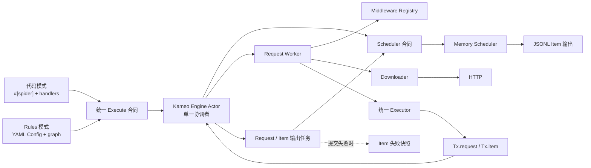
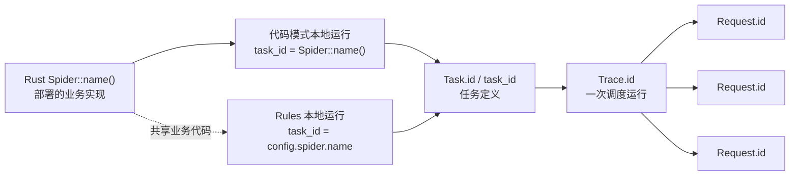
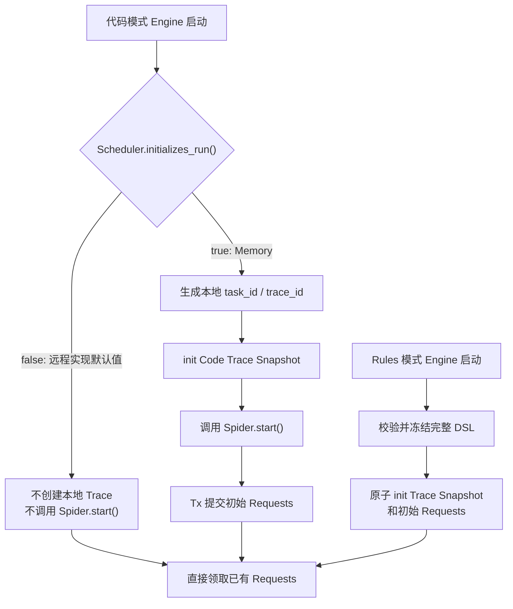
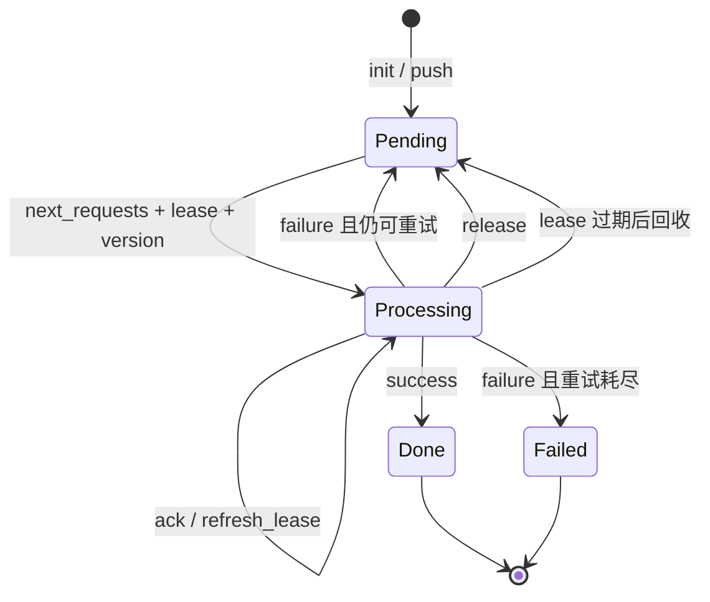
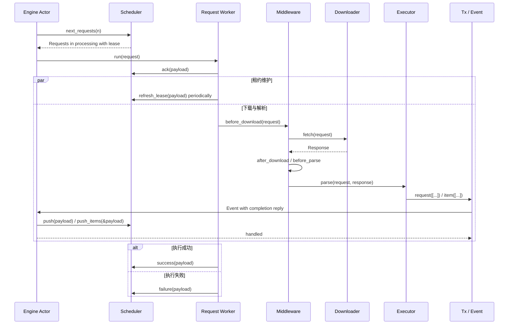

# crawler 架构与功能说明

本文描述当前源码已经实现的功能、核心运行模型和扩展边界。它是一份可以独立阅读的架构总览。

## 1. 定位与当前范围

`crawler` 是一个 Rust 2024 workspace。当前可运行形态是单进程异步爬虫运行时，默认使用内存 Scheduler 和 HTTP Downloader。代码模式与 YAML Rules 模式共享同一套 Engine、Request、Response、Item、Middleware、Scheduler 和 Payload，不存在第二套规则引擎。

当前 workspace 包含四个 crate：

| crate | 职责 |
| --- | --- |
| `spider` | 核心运行时、公共数据对象、扩展合同，以及默认 Memory Scheduler 和 HTTP Downloader |
| `macros` | `#[spider]` 过程宏；生成代码模式 Spider 的构造、node 注册和分发连接代码 |
| `contrib` | 外部 Scheduler 等可替换实现的边界；当前 API、Redis、MySQL 模块仍是占位结构 |
| `examples` | 可运行的代码模式和 Rules 模式示例 |

### 1.1 能力状态

| 能力 | 当前状态 | 说明 |
| --- | --- | --- |
| 代码模式 | 已实现 | 使用 `#[spider]`、异步 handler、`Tx.request` 和 `Tx.item` |
| YAML Rules 模式 | 已实现 | 配置校验、请求图、字段提取、绑定、转换、Item Schema 与下一跳 Request |
| Memory Scheduler | 已实现 | 优先级/FIFO 队列、延迟请求、租约、续租、重试、终态、Trace 与统计 |
| HTTP Downloader | 已实现 | headers、cookies、body、timeout、redirect、proxy 和 TLS 配置 |
| Browser Downloader | 未实现 | 当前为明确返回 `UnsupportedMode("browser")` 的占位实现，计划在 v5 完成 |
| CSS Selector | 已实现 | `Response::css()` 返回原生 `scrape_core::Soup` |
| CSS Healing | 已实现 | 普通 CSS 失败后执行确定性全文档候选评分；需要显式开启 |
| Regex 与 JSON | 已实现 | Regex 选择器，以及代码模式的 `Response::json<T>()` |
| AI Selector | 已实现 | 独立的 OpenAI-compatible JSON 提取，不属于 CSS Healing fallback |
| Middleware | 已实现 | 生命周期 Registry，以及 validate、dedup、rate limit、retry 内置能力 |
| Item 输出 | 已实现 | Schema 校验、媒体规范化、JSONL 输出和提交失败快照 |
| Worker 能力领取 | 规划中 | v3 OpenSpec 尚未实施；当前领取接口不按 Request `mode` 过滤 |
| API/Redis/MySQL Scheduler | 规划中 | v4 `contrib` 能力；必须完整实现相同 Scheduler 合同 |
| Master control-plane | 规划中 | v4 能力，不属于核心 Scheduler 本身 |
| 运行期链路追踪 | 规划中 | v4 使用 `fasttrace`；与业务 `trace_id` 是两个概念 |

XPath 已从路线中移除。HTML 的主选择能力固定为 CSS，不维护不完整的 XPath 子集。

## 2. 核心设计原则

1. **统一运行时**：代码模式和 Rules 模式使用同一个 Executor；Trace Snapshot 决定进入代码 handler 还是 Rules 解释路径，只有运行种子的初始化方式不同。
2. **Scheduler 是分布式边界**：从 Memory 切换到其他实现时，装配层只替换 `.with_scheduler(...)`；新实现必须承担完整调度语义，不能只是把一个存储客户端包起来。
3. **输出即时提交**：解析产生的 Request 和 Item 通过 `Tx` 立即进入 Engine，不等待整条 Trace 或整棵请求图结束。
4. **身份与执行权分离**：Request ID 在重试和恢复中不变；`version`、`leased_by` 和 `lease_time` 描述某一次执行权。
5. **不可变运行快照**：一个 Trace 对应一份不可变 Trace Snapshot；Rules 保存完整 DSL，代码模式不持久化 Rust handler。
6. **恢复必须显式**：租约、续租、归还、成功和失败分别使用独立接口，不用一个多义的 `finish` 覆盖不同状态变化。
7. **模块职责单一**：Actor 只协调，Worker 只持有单条 Request 的执行权，Executor 只解析，Scheduler 只实现调度和提交合同。

## 3. 系统总览



Engine 内部使用一个私有 Kameo Actor 作为消息驱动的单一协调者，但不会把 Scheduler、Downloader、Executor 或 AI 强制改造成 Actor。对外组件仍使用方法合同；Actor 直接持有运行状态和依赖，Request 与输出工作继续在独立 Tokio 任务中执行，长 I/O 不会阻塞消息处理。

## 4. 身份、Task 与运行种子

### 4.1 身份层级



- Rust `Spider::name()` 标识部署的业务实现，不再增加重复的 `spider.id`。
- Rules 的 `config.spider.name` 标识这份 Rules 任务并作为本地 `task_id`，不要求等于 Rust `Spider::name()`。
- `Task.id` 标识任务定义。持久化控制面可以用同一个 Spider 创建多个参数或周期不同的 Task。
- `Trace.id` 标识 Task 的一次运行。周期任务每次派发都应创建新的 Trace。
- `Request.id` 标识一条逻辑 Request；租约恢复和队列重试保持该 ID 不变。
- 本地 Memory 没有持久化 Task 表：代码模式使用 Rust `Spider::name()` 作为 `task_id`，Rules 模式使用 `config.spider.name`。
- Item ID 不在这条层级中。`Tx.item` 会为缺少 ID 的 Item 生成 UUID v7；它只是数据实例 ID，不负责业务去重。

### 4.2 运行种子

一轮运行的逻辑输入是：

```text
task_id + trace_id + immutable Trace Snapshot + initial Requests
```

Trace Snapshot 保存本轮 Request 共享的 `task_id`、参数、可选附件配置、持久化目标和优先级，不保存 schema 版本、Task revision 或静态推导的 Request mode 集合。Rules Snapshot 额外包含完整 DSL，其中可选的 `spider.version` 必须非空，`spider.timezone` 必须是有效 IANA 时区；代码 Snapshot 的 `dsl` 固定为空。

Request Snapshot 保存稳定 `node` 和可执行请求字段，不保存 handler、函数指针、闭包或进程内对象：

- Rules Request 恢复时，通过 `trace_id` 取得 Trace Snapshot 中的 DSL，再校验并恢复 node。
- Code Request 恢复后仍只有 node 名称；当前 Worker 使用本地 `#[spider]` 注册表解析对应 handler。
- Worker 在领取、重试或恢复时继承 Request 原有的 `task_id / trace_id`，不能生成或覆盖它们。

### 4.3 当前启动路径



`scheduler::Init::initializes_run()` 当前控制代码模式是否创建本地运行。Memory 返回 `true`；远程 Scheduler 默认返回 `false`，因此代码 Worker 可以只消费外部任务源已经发布的运行。

Rules 模式当前把加载的 YAML 视为本次运行定义，在开始领取前由 `rules::Init` 原子写入 Trace Snapshot 和初始 Requests。未来由外部控制面派发的 Rules Worker 需要沿用同一快照合同，而不是在 Worker 内重新解释出另一套身份。

## 5. Engine Actor

`Runtime::start()` 的外层顺序固定为：

```text
校验运行限制
-> open Scheduler / Downloader / 本地快照目录
-> before_spider
-> 初始化或接入运行
-> 启动并排空 Engine Actor
-> after_spider
-> close Downloader / Scheduler
```

`engine/actor.rs` 中的 `Engine` 是真实的 Kameo Actor，也是唯一协调者，持有以下运行状态：

- Executor 启动、轮询和 producer 空闲观察任务句柄；
- 至多一个正在进行的 Scheduler 领取任务；
- 当前 Request 任务集合；
- 当前 Tx 输出处理任务集合；
- Tx Event 容量、producer 活跃状态和第一个终态错误；
- Scheduler、Downloader、Executor、Middleware Registry 和可选 Item 快照存储的共享引用。

启动、领取、Request、输出、轮询和 producer 空闲分别通过独立 Actor 消息报告完成。所有派生任务都会捕获 panic 并报告完成。Kameo mailbox 对内部消息使用无界队列；显式 Event 容量只限制外部 `Tx` 输出，不会把内部完成消息计入用户配置的容量。

### 5.1 三个独立限制

| 设置 | 默认值 | 含义 |
| --- | ---: | --- |
| `with_concurrency(n)` | `16` | 同时运行的 Request 任务上限 |
| `with_limit(n)` | 等于 concurrency | 一次 `next_requests(limit)` 最多领取的 Request 数 |
| `with_event_limit(n)` | `32` | 已被 Tx 接受、但 Actor handler 尚未开始的 Event 上限 |

三个值在 Engine 启动时校验并加载，不支持运行中热更新，也不会互相替代。一次实际领取数量为：

```text
min(claim_limit, request_concurrency - active_request_tasks)
```

Event permit 在 `Tx` 发送前获取，并在 Engine Actor 开始处理该 Event 时释放。Handler 登记独立输出任务并委托应答；`Tx` 仍会等待 Scheduler 与 Middleware 处理完成。Event 容量因此限制等待开始的 Event，而 Actor 的输出任务集合独立保证处理期间不会提前退出。

### 5.2 空闲与退出

一次 `next_requests(limit)` 返回空集合只表示当前领取没有结果，不能直接结束 Engine。Actor 只有同时满足以下条件才退出：

- Scheduler 已确认没有排队或执行中的 Request；
- 没有启动、领取、轮询或 producer 空闲观察任务；
- 没有 Request 任务；
- 没有输出任务；
- 没有活跃的 Event permit；
- 没有仍可能产生 Event 的 Tx producer。

空领取结果只对该次领取观察到的工作状态有效。如果领取期间有 Request、输出 Event 或 Tx producer
改变了工作状态，Actor 会把该结果视为过期，并在退出前重新领取确认。

这一条件保证列表页产生的详情 Request、延迟到达的 Item，以及 handler 内克隆 Tx 后产生的输出都不会被提前丢弃。

## 6. Scheduler 合同与 Memory 实现

### 6.1 Scheduler 方法

| 方法 | 单一语义 |
| --- | --- |
| `dir` | 返回可选的 Worker 本地目录；用于框架本地 Item 失败快照 |
| `lease` | 返回可选的租约超时和续租间隔 |
| `open / close` | 打开和关闭 Scheduler 自身资源 |
| `push` | 只消费 `Payload.requests`，提交解析产生的 Requests |
| `push_items` | 只消费 `Payload.items`，提交 Items |
| `trace` | 按 `trace_id` 读取不可变 Trace Snapshot |
| `next_requests(limit)` | 最多领取并恢复 `limit` 条 Request |
| `has_pending_requests` | 判断当前 Scheduler 范围内是否仍有排队或执行中的 Request |
| `ack` | 确认 Engine 已接受当前领取的执行权 |
| `release` | 主动归还执行权，不消耗队列层重试次数 |
| `refresh_lease` | 延长当前已确认执行权的租约 |
| `success` | 只执行成功结算和统计合并 |
| `failure` | 只执行失败结算、统计合并及队列层重试 |

`scheduler::Init` 在此基础上增加：

- `initializes_run()`：当前 Engine 是否负责创建本地运行；
- `init(trace_id, snapshot, requests)`：原子保存 Trace Snapshot 和初始 Request 集合。

`Payload` 是这些方法共用的唯一传输信封，不增加 Batch、Receipt 或其他平行结构。它携带 Request 执行身份、状态、错误、时间、统计以及 `requests / items` 两个输出集合；每个 Scheduler 方法会拒绝与自身语义无关的字段。例如 `push` 只允许 Requests，`push_items` 只允许 Items，结算 Payload 的两个集合必须为空。

任何 `contrib` Scheduler 都必须完整实现这些状态和身份语义。Engine 不应针对 Redis、MySQL 或 API 写特例。

### 6.2 Memory 的状态模型



Memory 在一个受互斥锁保护的状态中原子维护队列、已知 Request ID、processing、ack、完成记录、Trace Snapshot 和 Trace 统计：

- 同一 payload 内的重复 Request ID，以及已经登记过的 Request ID，都会被拒绝；
- ID 去重防止同一 Request 对象重复入队，URL 或业务字段去重仍由 Dedup Middleware 负责；
- ready 队列先按较高 `priority` 出队，同优先级按 FIFO；未来执行时间由 delayed 队列管理；
- 领取时 Request 进入 `processing`，写入 `leased_by / lease_time` 并推进 `version`；
- 默认租约超时为 30 秒，续租间隔为 10 秒，也可通过 `Memory::with_lease(...)` 配置；
- `ack` 对同一有效身份幂等，只记录执行确认；`refresh_lease` 才刷新已确认执行的 `lease_time`；
- 未 ack 的领取过期时不消费重试次数，也不记录失败 Worker；已 ack 的执行过期时追加当前 Worker并消费一次队列尝试；
- 回收和重试只把 Request 放回 pending，不改变 `version`；下一次成功领取时才创建新的执行 generation；
- `Request.failed_workers` 按发生顺序保存且不重复，严格的 Request Snapshot 合同会完整保留并校验该字段；
- `success / failure` 对同一身份和同一终态的重复提交幂等，但会拒绝 task、trace、node、worker、version 或 state 不匹配的提交；
- `failure` 保持 Request ID并增加队列重试次数；有剩余额度时回填，额度耗尽后进入 failed 终态。
- Snapshot 恢复、version/retry 溢出或队列转换失败都会形成带原 Request ID 和原因的显式终态记录，不允许只增加计数后丢弃。

Memory 是未注册 Worker 的进程内实现，不做 Worker 集合筛选；注册、心跳和跨 Worker 领取资格留给 v4 contrib Scheduler。它从不可变的进程内映射读取 Trace Snapshot，不存在远程 cache、传输重试或“Trace 存储临时不可用”分支。进程退出后不恢复 Request 队列；当前也不会在 `data/requests/` 写本地 Request 文件快照。

## 7. 单条 Request 的完整生命周期



关键语义：

- `ack` 在 Downloader 执行前发生；ack 失败时不会继续下载该 Request。
- `release` 用于主动归还尚未完成的执行权，不等于失败，也不增加重试次数。
- 租约维护覆盖下载、解析以及最终 `success / failure` 重试过程。
- Middleware Retry 是当前 Worker 内的下载、解析或 Item 提交重试。
- Scheduler `failure` 是唯一的队列层 Request 重试入口。只有本地执行重试耗尽后，Worker 才提交 failure。
- `Tx.request` 和 `Tx.item` 都等待其 Event 真正处理完成，因此解析成功不会早于输出被 Scheduler 接受。
- Item 提交最终失败会返回到当前解析调用，并使当前 Request 走失败结算。
- `Response::follow` 始终继承 vals 与 Trace 身份，只在同源目标继承 headers/cookies；跨源目标从空凭据开始。
- HTTP Downloader 在发送每个 redirect target 前检查 `allowed_domains`；越界目标按正常过滤处理，不进入下载重试或 `error_download`，允许的跨源 redirect 也不继承 headers/cookies。
- 同源 redirect 会把中间响应的 `Set-Cookie` 应用到下一跳；一旦跨源，之前累积的凭证会在发送前清空。

Proxy 和 TLS 都是 Request 级下载配置。`Http` 使用完整 proxy URL（包括凭据）与
`tls.accept_invalid_certs` 组成 Client 池键，直连请求使用独立的无代理键。相同键可以并发复用；
最后一个使用句柄释放后开始计算空闲时间，空闲 90 秒的条目在后续访问时惰性清理。
`Http::close()` 会清空池并使并发中的冷启动插入失效，close 前开始构造的 Client 不能在 close 后
重新挂回池中。同一 Request 的 redirect 保持使用该 Request 已选择的 Client；proxy/TLS 不会变成
Downloader 的可变全局状态。

每条 Request 执行使用一个共享 `stats::Delta`，按 node 或 `items` 累积 `total / done / filter / dedup / validate / download` 计数。当前 Request task 内直接等待的 Tx 调用使用 task-local Context，并写入这份增量；移入独立 task 的 Tx clone 只保留 Trace 身份，其输出不改变已经结算的 Request，也不延迟该 Request 结算。Worker 在最终 Payload 中附带增量快照，Scheduler 只在 `success / failure` 首次结算时合并到 Trace 统计，幂等重放不会重复累计。

## 8. 两种执行模式

### 8.1 代码模式

`#[spider]` 宏让业务代码只声明 Spider 字段和异步方法：

- `name` 是唯一 Spider 名称；
- `start_urls / start` 产生初始 Request；
- `index` 是默认 node；其他 handler 方法注册为稳定 node；
- handler 使用 `self.tx.request(Vec<Request>)` 产生下一跳 Request；
- handler 使用 `self.tx.item(Vec<Item>)` 产生 Item。

宏只生成类型检查、构造、node 注册和 handler 调用连接代码。Engine 状态机、Scheduler、Downloader 和 Middleware 不进入过程宏。

### 8.2 Rules 模式

Rules 从 YAML 加载任务配置、请求图、字段提取、数据绑定、转换、完整下一跳 Request Spec 和 Item
Schema。Rules 运行时仍必须通过 `with_spider(...)` 装载 Rust Spider；Spider 提供共享业务代码和具体
Item 类型。`with_rules(config)` 只表示本地创建一轮 Rules Trace 种子；不调用它时可以创建代码模式
运行或消费远端 Scheduler 中已有的 Code/Rules Trace。Rules 任务名不要求等于 `Spider::name()`。

`Config::validate()` 在运行前完整校验 start/target node、Request transport、模板上下文、保留
`idx` 以及每个 node 最多一条 Item edge 等约束，后端或 API 保存配置前可以复用同一入口。

统一 Executor 按固定顺序执行每条 Rules Request：

```text
Trace Snapshot.dsl = Some(config)
-> Rust Spider.index(response.clone())
-> Request.node
-> graph.nodes[node]
-> 下载后的字段提取
-> bind / transform / template
-> 完整 Request Spec 和/或具体 Rust Item
-> 共用 Tx 与 Scheduler 链路
```

Rust `index` 是每条 Rules Request 固定经过的共享业务代码入口。只有它成功返回后，同一个 Executor
才解释声明式 node；代码模式 Request 则直接通过 Rust Spider 注册表解析其稳定 node。

`spider.start[*]` 与 request edge 共用同一完整 Request Spec。Graph node 只包含 parse、bind 和域名
策略，Request 创建后不再从目标 node 补 transport。URL 数组按稳定顺序展开，在 transport 模板渲染前
写入从 `1` 开始的保留 `vals.idx`，每层新展开重新计数。

Rules 不会编译成另一套 Request 或 Item 类型。它通过 `Item::from_values` 构造 Spider 关联的 Rust
Item，注入当前 `SchemaKey`，再调用默认 `item` 或 edge `fn` 指定的函数。业务函数通过 `Tx.item`
提交，因此 Middleware 和持久化链路完全共用。

字段 extractor 按声明顺序尝试。空结果继续下一个 extractor；最终结果按匹配数量折叠：

- 零个匹配：`null`，或使用 `default`；required 字段则报错；
- 一个匹配：标量或节点对象；
- 多个匹配：数组。

CSS 表达式支持 `::text`、`::attr(name)` 和元素输出。元素对象固定包含 `html`、`text` 和 `attrs`。

## 9. Selector 与数据提取

### 9.1 CSS 与 Healing

代码模式通过以下入口获得原生 Soup：

```rust
let soup = response.css()?;
let nodes = soup.select("article h2")?;
```

普通业务可以直接调用 `Tag::text()`、`Tag::outer_html()` 和 `Tag::get(...)`。框架不在 Soup 外再包一层节点对象。

公共 Healing API 是 `selector::css::select(&soup, expr, &config)`。流程固定为：

```text
编译合法 CSS
-> 普通精确选择
-> 命中时直接返回
-> 未命中且显式配置 healing 时遍历全部 DOM 元素
-> 按 CSS AST 中明确声明的约束评分
-> 返回达到 min 的所有最高分节点，保持 DOM 顺序
```

评分覆盖标签、ID、class、属性、组合关系和支持的静态伪类。候选的额外属性不扣分；默认 `min` 为 `0.8`，合法范围是 `0.0..=1.0`。

Healing 只接受 `scrape-core 0.2.9` 能成功编译的语法；该解析器当前会在 Healing 开始前拒绝 `:is()`、`:where()` 和 `:has()`。

Healing 不保存历史节点指纹、不改写或持久化修复后的 selector、不跨 selector 类型，也不会调用 AI。非法 CSS 直接返回 CSS 错误；低于 `min` 返回空集合，让 Rules 继续当前字段的下一个 extractor。

### 9.2 Regex、JSON 与 AI

- Regex 返回所有捕获结果；存在第一捕获组时优先返回该组，否则返回完整匹配。
- `Response::json<T>()` 直接从响应 body 反序列化结构化 JSON。
- AI 是与 CSS、Regex 并列的显式 selector。它使用 `async-openai` 调用 OpenAI-compatible Chat Completion，将当前 Response 文本和 `expr` 组合成 prompt，再把模型内容解析为一个 JSON 值。
- Rules 中持久化的 `api_key` 必须使用 `env:VARIABLE` 引用；Worker 执行时才读取真实密钥。代码直接构造的临时配置可以传入密钥，但配置序列化会拒绝直接密钥。
- AI 不生成 CSS，CSS Healing 也不会把候选交给 AI。

### 9.3 媒体字段

Rules 的 `image / video / audio` 是数据处理类型，不是 validator 类型。字段提取完成后、Item Schema 校验前，框架把 URL、字符串或 HTML 节点对象规范化为数组，元素固定包含：

```text
name, url, src, width, height, size, ext, alt
```

相对 URL 会根据当前 Response URL 补全，同一字段内按规范化后的 `url` 去重；原始 `src` 只是元数据，不作为去重键。普通 text 字段不执行媒体规范化。

## 10. Middleware 生命周期

当前已接入的 hook 是：

```text
before_spider
before_scheduler
before_download
after_download
before_parse
before_item
error_download
error_parse
error_item
after_spider
```

`Middleware::Next<T>` 只有 `Continue(T)` 与 `Skip`。`Skip` 是正常过滤，不进入对应 error hook。Registry 合并默认 Spec 与对象局部 Spec，再按 `order` 和声明顺序执行。

内置实现：

| Middleware | 作用位置 | 语义 |
| --- | --- | --- |
| `validate` | 默认接入多个正常 hook | 校验 Request/Response 基本约束，并通过 `SchemaKey` 调用 validator 校验 Item |
| `dedup` | `before_scheduler` | 按配置字段计算 Request 指纹；缺省或 `-1` TTL 永不过期 |
| `rate_limit` | `before_download` | 按 group 和 QPS 控制下载速率 |
| `retry` | error 配置 | 为 download、parse、Item 提交提供 Worker 本地重试策略 |

`Builder::with_middleware(name, value)` 注册能力，不表示自动挂载到所有对象。Request、Response、Item 和 Spider 生命周期通过各自的 `middleware::Spec` 显式选择能力。只有 validate 的正常阶段 Spec 是 Registry 默认配置。

默认 Dedup 只处理配置 key 生成的 Request fingerprint，不处理 Item，也不增加隐式 URL key。指纹在 `before_scheduler` 观察 Request 时检查并写入，因此后续 `Scheduler::push` 失败不会回滚。SHA-256 输入是 `task_id`、Middleware key、rule name 与有序字段值组成的结构化元组，不使用可能碰撞的字符串 namespace 拼接。URL 归一化只按 query key 稳定排序，同名 key 保持原始顺序。所有启用规则先完成有限 TTL deadline 校验，再在同一把锁内统一检查并写入；任一 TTL 错误都不会留下部分指纹。某条规则的 `ttl: 0` 表示既不查询也不保存该规则指纹；省略或 `-1` 在进程生命周期内永久保留且不做容量淘汰。精确存储使用 `HashMap` 和过期时间堆，只从堆头惰性清理到期项。

## 11. Item、校验与本地持久化

Item 主链固定为：

```text
Tx.item
-> 缺少 ID 时生成 UUID v7
-> before_item
-> Scheduler.push_items(&Payload)
-> 成功，或按 error_item 策略重试
-> 最终失败时 error_item，并使当前 Request 失败
```

每个具体 Item 必须持有一份不参与序列化的 `item::State`，实现 `state / state_mut`，并实现强制的
`Item::from_values` Rules 构造入口；代码模式 Item 仍可使用普通 Rust 构造函数。额外 Rules Item
函数必须用 `#[item]` 显式注册，本地 Builder 在运行时初始化前拒绝缺失的函数。Schema Store 对
规范化后的 schema 计算稳定 SHA-256 key、缓存 `validator::Validator`，再对序列化后的 Item 执行
校验。Item ID 不进入 schema，也不参与业务去重。

默认 Memory 的输出根目录是当前工作目录，可通过 `Memory::with_dir(path)` 同时改变正常输出和失败快照根目录。

正常 Item 输出：

```text
<dir>/data/items/output/<task_id>/<yyyy-mm-dd-HH>.jsonl
```

每个 Item 写一行 JSON，JSONL 只包含 Item 的业务序列化结果。并发写入同一小时文件会串行化，每次完整追加后立即 flush；写入失败时尝试回滚本次追加，`close()` 再次刷新全部打开文件。

`version / timezone` 是 Trace 级运行元数据，持久化 Scheduler 在 `push_items` 时可通过
`payload.trace_id` 读取对应 Trace Snapshot，并按需要反规范化到自己的 Item 记录。列名固定为
`config_version / timezone`；裸 `version` 保留给 Request 执行权。这些元数据不自动注入业务
Item JSON，也不复制到每条 Request Snapshot；默认 Memory JSONL 不保存这些运行字段。

提交失败快照：

```text
<dir>/data/items/snapshots/<task_id>/<yyyy-mm-dd-HH>/<uuid-v7>.json
```

- 第一次 `push_items` 失败时尝试写快照，然后继续既定重试；
- 快照写入失败不阻止 Scheduler 重试；
- 后续重试成功时删除快照；删除失败不改变 Item 已成功的结果；
- 重试耗尽时快照保留，当前没有自动回放，需人工处理；
- 其他 Scheduler 只有在 `dir()` 返回本地目录时才启用框架本地快照。

Item 提交采用 at-least-once 语义。业务级 Item 去重应由下游或自定义 Scheduler 的 Item 提交实现处理。

## 12. 源码职责划分

| 路径 | 单一职责 |
| --- | --- |
| `spider/src/engine/actor.rs` | 持有 Engine Actor 状态及统一推进和退出判断 |
| `spider/src/engine/actor/start.rs` | 启动 Executor 工作并处理完成消息 |
| `spider/src/engine/actor/claim.rs` | 领取 Scheduler 工作并处理完成消息 |
| `spider/src/engine/actor/request.rs` | 登记一条 Request 任务并处理完成消息 |
| `spider/src/engine/actor/output.rs` | 接受 Tx Event、委托应答并跟踪输出完成 |
| `spider/src/engine/actor/wait.rs` | 安排轮询与 producer 空闲通知 |
| `spider/src/engine/actor/task.rs` | 持有任务句柄并把任务 panic 转为 Engine 错误 |
| `spider/src/engine/builder.rs` | 装配组件并持有所有执行模式共用的 Schema Store |
| `spider/src/engine/runtime.rs` | 组件生命周期、启动参数和 Actor 装配 |
| `spider/src/engine/worker.rs` | 单条 Request 的 ack、租约维护和最终结算 |
| `spider/src/engine/request.rs` | 下载、Middleware、Worker 本地重试与解析主链 |
| `spider/src/engine/event/request.rs` | 处理 Tx 产生的 Request 输出 |
| `spider/src/engine/event/item.rs` | 处理 Item、提交重试与失败快照 |
| `spider/src/engine/executor.rs` | 根据 Trace Snapshot 选择 Code/Rules 并调用共享 Spider |
| `spider/src/engine/code.rs` | 代码模式本地运行种子初始化 |
| `spider/src/engine/rules.rs` | Rules 模式装配与运行种子初始化 |
| `spider/src/engine/rules/executor.rs` | 协调一次 Rules node 执行并发送产物 |
| `spider/src/engine/rules/executor/field.rs` | 从当前 Response 提取声明字段 |
| `spider/src/engine/rules/executor/value.rs` | 从当前 Rules 上下文解析类型化值引用 |
| `spider/src/engine/rules/executor/bind.rs` | 执行有序 bind pipeline、transform 和 template |
| `spider/src/engine/rules/executor/condition.rs` | 判断一条 edge 条件 |
| `spider/src/engine/rules/executor/build.rs` | 从已启用 edge 构造 Request 与 Item 值 |
| `spider/src/middleware/registry.rs` | 只注册并解析 Middleware 实现和 Spec |
| `spider/src/downloader/http.rs` | 执行 HTTP 请求、redirect、headers、cookies 与 Response 转换 |
| `spider/src/downloader/http/pool.rs` | 按 proxy/TLS 键管理 Client 复用、过期与关闭 |
| `spider/src/scheduler/contract.rs` | Scheduler 公共合同 |
| `spider/src/scheduler/init.rs` | 运行种子初始化合同 |
| `spider/src/scheduler/memory.rs` | Memory 对外实现与子模块编排 |
| `spider/src/scheduler/memory/claim.rs` | 领取、租约回收和 Request 恢复 |
| `spider/src/scheduler/memory/queue.rs` | ready/delayed 排队顺序 |
| `spider/src/scheduler/memory/settle.rs` | 身份校验、成功/失败和队列重试 |
| `spider/src/scheduler/memory/state.rs` | Memory 运行状态数据结构 |
| `spider/src/selector/css/healing.rs` | Healing 配置与总体流程 |
| `spider/src/selector/css/healing/reference.rs` | CSS AST 到评分参考结构 |
| `spider/src/selector/css/healing/score.rs` | DOM 候选遍历、关系判断与评分 |
| `macros/src/spider/model.rs` | 解析用户 Spider 结构和方法模型 |
| `macros/src/spider/check.rs` | 宏输入约束校验 |
| `macros/src/spider/bind.rs` | 生成 node 注册与 handler 绑定代码 |
| `contrib/src/scheduler/*` | 后续外部 Scheduler 实现边界 |

命名依赖模块上下文表达含义。例如 `request::State`、`memory::State`、`registry::Bind` 不重复附加模块名前缀；文件也不混入无关的解析、存储或控制面职责。

## 13. 扩展边界与后续版本

### 当前尚未实现

- v3：Worker 能力参与 Scheduler 原子领取；HTTP 字符集处理和更完整真实页面回归。
- v4：API、Redis、MySQL Scheduler；Master control-plane；可审计 Item 快照回放；`fasttrace` 运行期链路追踪。
- v5：真实 Browser Downloader 和 HTTP/Browser 混合 Worker 能力。

这些能力必须沿用当前核心合同：

- Scheduler 替换不能改变 Engine、Spider、Downloader、Middleware、Request、Response 或 Item 的业务形态；
- API/Redis/MySQL 实现必须自行完成领取原子性、租约、续租、版本校验、重试、终态、Trace 读取和 Item 提交；
- Worker 能力筛选必须在 Scheduler 领取时原子完成，不能先领取不兼容 Request 再由 Downloader 丢弃；
- Browser 必须实现现有 `Download` 合同，输出同一个 `Response` 模型；
- `fasttrace` 的 span context 只用于运行期观测，不能替代业务 `task_id / trace_id`。

### 当前明确不做

- 不保存或自动更新 CSS Healing 的历史指纹；
- 不让 Healing 自动调用 AI；
- 不提供 XPath 子集；
- 不在 Engine 末尾批量提交整个 Trace 的 Items；
- 不让 Item ID 承担业务去重；
- 不让核心 `spider` crate 依赖 `contrib` 或控制面实现。

## 14. 架构不变量

实现和扩展应持续满足以下检查：

1. 同一 Request 在同一时刻只有一个有效执行权；旧 version 或旧 Worker 的结算必须被拒绝。
2. Request 重试保留 `id / task_id / trace_id / node / version` 并推进重试状态；下一次成功领取时才推进执行 generation。
3. 代码与 Rules 不序列化 Rust handler；代码 Worker 只按稳定 node 调用本地注册表。
4. `Tx.request / Tx.item` 产生的输出即时处理，Engine 在所有潜在 producer 排空前不能退出。
5. `success`、`failure`、`release`、`refresh_lease` 各自只表达一种状态语义。
6. CSS Healing 和 AI 始终是独立、显式的选择能力。
7. 规划中的组件不能以占位文件或配置字段被描述为已实现能力。

## 15. 相关文档

- [架构文档索引](./架构设计文档.md)
- [English architecture overview](./architecture.md)
