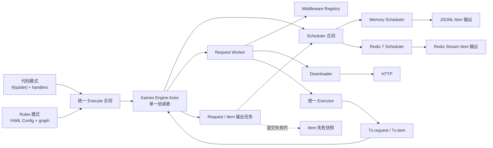
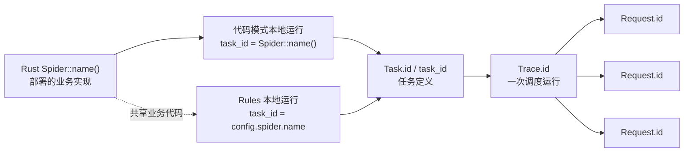
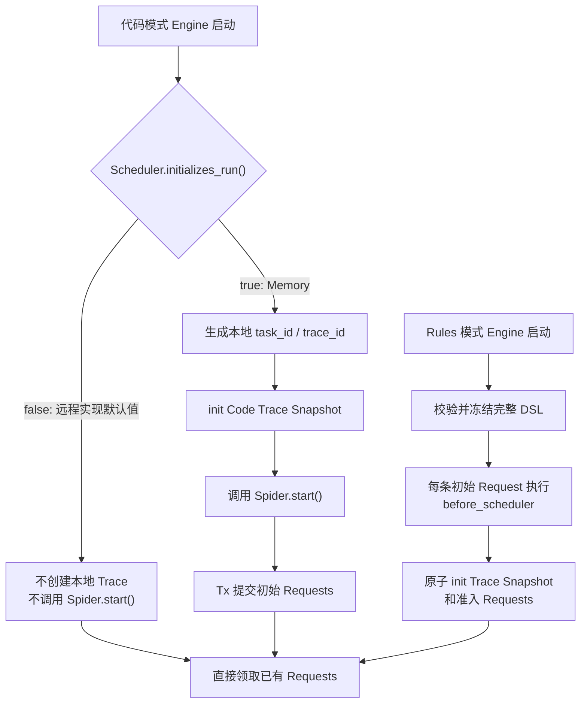
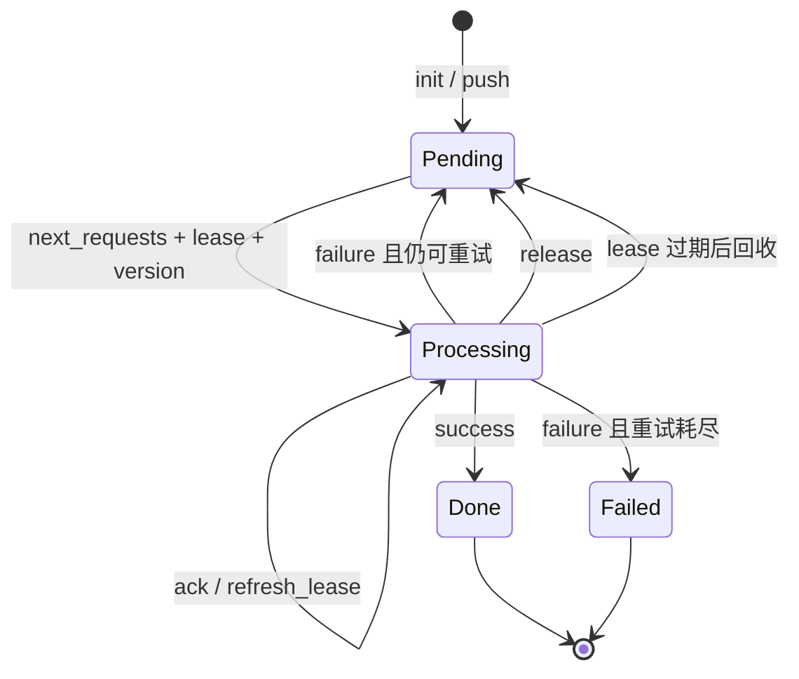
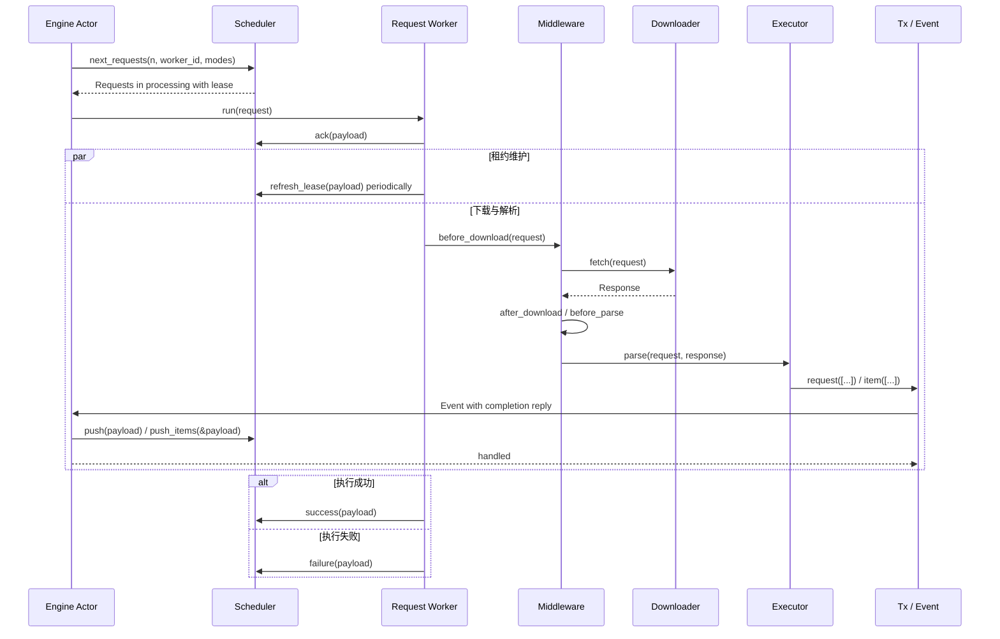

# crawler 架构与功能说明

本文描述当前源码已经实现的功能、核心运行模型和扩展边界。它是一份可以独立阅读的架构总览。

## 1. 定位与当前范围

`crawler` 是一个 Rust 2024 workspace。默认可运行形态是单进程异步爬虫运行时，使用内存 Scheduler 和 HTTP Downloader；`contrib` 还提供 Redis 7 单实例 Scheduler，用于持久化多 Worker 队列。代码模式与 YAML Rules 模式共享同一套 Engine、Request、Response、Item、Middleware、Scheduler 和 Payload，不存在第二套规则引擎。

当前 workspace 包含四个 crate：

| crate | 职责 |
| --- | --- |
| `spider` | 核心运行时、公共数据对象、扩展合同，以及默认 Memory Scheduler 和 HTTP Downloader |
| `macros` | `#[spider]` 过程宏；生成代码模式 Spider 的构造、node 注册和分发连接代码 |
| `contrib` | 可替换外部 Scheduler 的实现边界；Redis 已实现，API 与 MySQL 仍是后续工作 |
| `examples` | 可运行的代码模式和 Rules 模式示例 |

### 1.1 能力状态

| 能力 | 当前状态 | 说明 |
| --- | --- | --- |
| 代码模式 | 已实现 | 使用 `#[spider]`、异步 handler、`Tx.request` 和 `Tx.item` |
| YAML Rules 模式 | 已实现 | 配置校验、请求图、字段提取、绑定、转换、Item Schema 与下一跳 Request |
| Memory Scheduler | 已实现 | 优先级/FIFO 队列、延迟请求、租约、续租、重试、终态、Trace 与统计 |
| HTTP Downloader | 已实现 | 有界解码 body、完整 fetch 超时、结构化 headers/cookies、redirect、proxy/TLS 隔离和有界空闲 Client |
| Response 字符集解码 | 已实现 | `Response::text()` 按 BOM/header/HTML meta/UTF-8 确定性选择，并保留 HTTP 内容解码后 bytes |
| Browser Downloader | 未实现 | 当前为明确返回 `UnsupportedMode("browser")` 的占位实现，计划在 v5 完成 |
| CSS Selector | 已实现 | `Response::css()` 返回原生 `scrape_core::Soup` |
| CSS Healing | 已实现 | 普通 CSS 失败后执行确定性全文档候选评分；需要显式开启 |
| Regex 与 JSON | 已实现 | Regex 选择器，以及代码模式的 `Response::json<T>()` |
| AI Selector | 已实现 | 独立的 OpenAI-compatible JSON 对象提取，不属于 CSS Healing fallback |
| AI 运行时配置 | 已实现 | 通过 `Engine::with_ai` 注入一个 Worker 本地可复用的 `ai::OpenAI` provider；provider 配置不进入 Rules 或 Trace Snapshot |
| Middleware | 已实现 | 生命周期 Registry，以及 validate、dedup、rate limit、retry 内置能力 |
| Item 输出 | 已实现 | Schema 校验、媒体规范化、JSONL 输出和提交失败快照；附件下载计划在 v5 实现 |
| Worker 能力领取 | 已实现 | Memory 只在当前 Worker 配置的 Request mode 范围内领取并判断待处理工作 |
| Redis Scheduler | 已实现 | 仅 Redis 7+ 单实例；按 namespace 隔离，完整实现 Scheduler/Init 合同、Lua 原子转换与 Redis Stream Item 输出 |
| API/MySQL Scheduler | 规划中 | 独立的 v4 `contrib` 实现；必须完整实现相同 Scheduler 合同 |
| Master control-plane | 规划中 | v4 能力，不属于核心 Scheduler 本身 |
| 运行期链路追踪 | 规划中 | v4 使用 `fasttrace`；与业务 `trace_id` 是两个概念 |

XPath 已从路线中移除。HTML 的主选择能力固定为 CSS，不维护不完整的 XPath 子集。

## 2. 核心设计原则

1. **统一运行时**：代码模式和 Rules 模式使用同一个 Executor；Trace Snapshot 决定进入代码 handler 还是 Rules 解释路径，只有运行种子的初始化方式不同。
2. **Scheduler 是分布式边界**：从 Memory 切换到其他实现时，装配层只替换 `.with_scheduler(...)`；新实现必须承担完整调度语义，不能只是把一个存储客户端包起来。
3. **输出即时提交**：解析产生的 Request 和 Item 通过 `Tx` 立即进入 Engine，不等待整条 Trace 或整棵请求图结束。
4. **身份与执行权分离**：Request ID 在重试和恢复中不变；`version`、`leased_by` 和 `lease_time` 描述某一次执行权。
5. **不可变运行快照**：一个 Trace 对应一份不可变 Trace Snapshot；Rules 保存完整 DSL，代码模式不持久化 Rust handler。
6. **恢复必须显式**：租约、续租、归还、成功和失败分别使用独立接口，不用一个多义的 `finish` 覆盖不同状态变化。
7. **模块职责单一**：Actor 只协调，启动时冻结的 Worker 状态只持有身份与能力，Request task 持有单次执行权，Executor 只解析，Scheduler 只实现调度和提交合同。

## 3. 系统总览



Engine 内部使用一个私有 Kameo Actor 作为消息驱动的单一协调者，但不会把 Scheduler、Downloader、Executor 或 AI 强制改造成 Actor。对外组件仍使用方法合同；Actor 直接持有运行状态和依赖，Request 与输出工作继续在独立 Tokio 任务中执行，长 I/O 不会阻塞消息处理。

## 4. 身份、Task 与运行种子

### 4.1 身份层级



- Rust `Spider::name()` 标识部署的业务实现，不再增加重复的 `spider.id`。
- Rules 的 `config.spider.name` 标识这份 Rules 任务并作为本地 `task_id`，不要求等于 Rust `Spider::name()`。
- `Task.id` 标识任务定义。持久化控制面可以用同一个 Spider 创建多个参数或周期不同的 Task。
- `Trace.id` 标识 Task 的一次运行。周期任务每次派发都应创建新的 Trace。
- `Request.id` 标识一条逻辑 Request；租约恢复和队列重试保持该 ID 不变。当前 Request 的 `Tx.request` 输出由框架使用父 Request ID、规范化后的子 Request 初始规格以及该规格在本次 parse attempt 中的出现次数派生子 ID；重放相同输出复用 ID，`Request::with_id` 设置的业务 ID 始终保留。
- 本地 Memory 没有持久化 Task 表：代码模式使用 Rust `Spider::name()` 作为 `task_id`，Rules 模式使用 `config.spider.name`。
- Item ID 不在这条层级中。`Tx.item` 会为缺少 ID 的 Item 生成 UUID v7；它只是数据实例 ID，不负责业务去重。

### 4.2 运行种子

一轮运行的逻辑输入是：

```text
task_id + trace_id + immutable Trace Snapshot + initial Requests
```

Trace Snapshot 保存本轮 Request 共享的 `task_id`、参数、可选附件配置、持久化目标和优先级，不保存 schema 版本、Task revision 或静态推导的 Request mode 集合。Rules Snapshot 额外包含完整 DSL，其中可选的 `spider.version` 必须非空，`spider.timezone` 必须是有效 IANA 时区；代码 Snapshot 的 `dsl` 固定为空。

Request Snapshot 保存稳定 `node` 和可执行请求字段，不保存 handler、函数指针、闭包或进程内对象：

- Rules Request 恢复时，通过 `trace_id` 取得 Trace Snapshot 中的 DSL，再校验并恢复 node。
- Code Request 恢复后仍只有 node 名称；当前 Worker 使用本地 `#[spider]` 注册表解析对应 handler。
- Worker 在领取、重试或恢复时继承 Request 原有的 `task_id / trace_id`，不能生成或覆盖它们。

### 4.3 当前启动路径



`scheduler::Init::initializes_run()` 当前控制代码模式是否创建本地运行。Memory 返回 `true`；远程 Scheduler 默认返回 `false`，因此代码 Worker 可以只消费外部任务源已经发布的运行。

Rules 模式把加载的 YAML 视为本次运行定义。开始领取前，每条初始 Request 都先经过与 Tx 输出相同的 `before_scheduler` 准入链路，再由 `rules::Init` 原子写入 Trace Snapshot 和准入后的 Requests。即使所有 Request 都被过滤，空运行仍保存 Trace Snapshot 并正常结束。未来由外部控制面派发的 Rules Worker 需要沿用同一快照合同，而不是在 Worker 内重新解释出另一套身份。

## 5. Engine Actor

`Runtime::start()` 的外层顺序固定为：

```text
校验运行限制
-> open Scheduler / Downloader / 本地快照目录
-> before_spider
-> 初始化或接入运行
-> 启动并排空 Engine Actor
-> after_spider
-> close Downloader / Scheduler
```

`engine/actor.rs` 中的 `Engine` 是真实的 Kameo Actor，也是唯一协调者，持有以下运行状态：

- Executor 启动、轮询和 producer 空闲观察任务句柄；
- 至多一个正在进行的 Scheduler 领取任务；
- 当前 Request 任务集合；
- 当前 Tx 输出处理任务集合；
- Tx Event 容量、producer 活跃状态和第一个终态错误；
- Scheduler、Downloader、Executor、Middleware Registry 和可选 Item 快照存储的共享引用。

启动、领取、Request、输出、轮询和 producer 空闲分别通过独立 Actor 消息报告完成。所有派生任务都会捕获 panic 并报告完成。已接受的输出失败通常返回正在等待的 `Tx` 调用方；如果调用方已取消，输出完成消息会把无法交付的错误报告给 Engine，不能静默成功。Kameo mailbox 对内部消息使用无界队列；显式 Event 容量只限制外部 `Tx` 输出，不会把内部完成消息计入用户配置的容量。

### 5.1 三个独立限制

| 设置 | 默认值 | 含义 |
| --- | ---: | --- |
| `with_concurrency(n)` | `16` | 同时运行的 Request 任务上限 |
| `with_claim_limit(n)` | 等于 concurrency | 一次 `next_requests(limit, worker_id, modes)` 最多领取的 Request 数 |
| `with_event_limit(n)` | `32` | 已被 Tx 接受、但 Actor handler 尚未开始的 Event 上限 |

三个值在 Engine 启动时校验并加载，不支持运行中热更新，也不会互相替代。一次实际领取数量为：

```text
min(claim_limit, request_concurrency - active_request_tasks)
```

Event permit 在 `Tx` 发送前获取，并在 Engine Actor 开始处理该 Event 时释放。Handler 登记独立输出任务并委托应答；`Tx` 仍会等待 Scheduler 与 Middleware 处理完成。Event 容量因此限制等待开始的 Event，而 Actor 的输出任务集合独立保证处理期间不会提前退出。

### 5.2 空闲与退出

一次 `next_requests(limit, worker_id, modes)` 返回空集合只表示当前领取没有结果，不能直接结束 Engine。Actor 只有同时满足以下条件才退出：

- Scheduler 已确认当前 Worker 能力范围内没有排队或执行中的 Request；
- 没有启动、领取、轮询或 producer 空闲观察任务；
- 没有 Request 任务；
- 没有输出任务；
- 没有活跃的 Event permit；
- 没有仍可能产生 Event 的 Tx producer。

空领取结果只对该次领取观察到的工作状态有效。如果领取期间有 Request、输出 Event 或 Tx producer
改变了工作状态，Actor 会把该结果视为过期，并在退出前重新领取确认。

这一条件保证列表页产生的详情 Request、延迟到达的 Item，以及 handler 内克隆 Tx 后产生的输出都不会被提前丢弃。

## 6. Scheduler 合同与 Memory 实现

### 6.1 Scheduler 方法

| 方法 | 单一语义 |
| --- | --- |
| `dir` | 返回可选的 Worker 本地目录；用于框架本地 Item 失败快照 |
| `lease` | 返回可选的租约超时和续租间隔 |
| `open / close` | 打开和关闭 Scheduler 自身资源 |
| `push` | 只消费 `Payload.requests`；跳过一致重放、原子写入缺失 Request，并拒绝存在冲突的整批数据 |
| `push_items` | 只消费 `Payload.items`，提交 Items |
| `trace` | 按 `trace_id` 读取不可变 Trace Snapshot |
| `next_requests(limit, worker_id, modes)` | 按传入的 Worker 身份和 modes 原子领取并恢复最多 `limit` 条 Request |
| `has_pending_requests(worker_id, modes)` | 判断传入 Worker 能力范围内是否仍有排队或执行中的 Request |
| `ack` | 确认 Engine 已接受当前领取的执行权 |
| `release` | 主动归还执行权，不消耗队列层重试次数 |
| `refresh_lease` | 延长当前已确认执行权的租约 |
| `success` | 只执行成功结算和统计合并 |
| `failure` | 只执行失败结算、统计合并及队列层重试 |

`scheduler::Init` 在此基础上增加：

- `initializes_run()`：当前 Engine 是否负责创建本地运行；
- `init(trace_id, snapshot, requests)`：原子保存 Trace Snapshot 和准入后的初始 Request 集合；过滤后的空集合合法。

`Payload` 是这些方法共用的唯一传输信封，不增加 Batch、Receipt 或其他平行结构。它携带 Request 执行身份、状态、错误、时间、统计以及 `requests / items` 两个输出集合；每个 Scheduler 方法会拒绝与自身语义无关的字段。例如 `push` 只允许 Requests，`push_items` 只允许 Items，结算 Payload 的两个集合必须为空。

`has_pending_requests` 的能力范围由 `modes` 定义。只要 processing Request 的 mode 匹配，所有具备该能力的 Worker 都将其视为 pending，不按当前 `leased_by` 过滤。`worker_id` 用于标识并校验调用方，不把 processing 集合缩小为该 Worker 自己持有的租约。这个保守退出规则避免兼容 Worker 在租约恢复前，或执行中 Request 继续产生兼容任务前提前退出。

任何 `contrib` Scheduler 都必须完整实现这些状态和身份语义。Engine 不应针对 Redis、MySQL 或 API 写特例。

### 6.2 Memory 的状态模型



Memory 在一个受互斥锁保护的状态中原子维护队列、已知 Request ID、processing、ack、完成记录、Trace Snapshot 和 Trace 统计：

- 同一 payload 内的重复 Request ID 会被拒绝；已存在 ID 与初始 Request Snapshot 完全一致时是 no-op，不同 Snapshot 则冲突并拒绝整批；
- 一批数据同时包含一致的已有 Snapshot 和新 Request 时，只原子写入缺失 Request；
- Memory 保存每个规范化初始 Request Snapshot 的 SHA-256 摘要用于重放比较；这是 Scheduler 身份保护，不是 URL 或业务去重；
- ID 去重防止同一 Request 对象重复入队，URL 或业务字段去重仍由 Dedup Middleware 负责；
- ready 队列先按较高 `priority` 出队，同优先级按 FIFO；未来执行时间由 delayed 队列管理；
- `Memory::new()` 只拥有进程内 Scheduler 状态；Engine 会在每次领取和待处理判断时传入非空 Worker ID 与 mode 集合；
- 领取会在传入的 mode 集合中选择 priority 最高且保持 FIFO 的 Request，不改变不兼容队列项；待处理判断使用同一 Worker 范围；
- 领取时 Request 进入 `processing`，写入 `leased_by / lease_time` 并推进 `version`；
- 默认租约超时为 30 秒，续租间隔为 10 秒，也可通过 `Memory::with_lease(...)` 配置为运行时时钟可表示的正整数毫秒；
- `ack` 对同一有效身份幂等，只记录执行确认；`refresh_lease` 才刷新已确认执行的 `lease_time`；
- 未 ack 的领取过期时不消费重试次数，也不记录失败 Worker；已 ack 的执行过期时追加当前 Worker并消费一次队列尝试；
- 回收和重试只把 Request 放回 pending，不改变 `version`；下一次成功领取时才创建新的执行 generation；
- `Request.failed_workers` 按发生顺序保存且不重复，严格的 Request Snapshot 合同会完整保留并校验该字段；
- `success / failure` 对同一身份和同一终态的重复提交幂等，但会拒绝 task、trace、node、worker、version 或 state 不匹配的提交；
- `failure` 保持 Request ID并增加队列重试次数；有剩余额度时回填，额度耗尽后进入 failed 终态。
- Snapshot 恢复、version/retry 溢出或队列转换失败都会形成带原 Request ID 和原因的显式终态记录，不允许只增加计数后丢弃。

Memory 是不注册到集群的进程内 Scheduler。Engine 持有 Worker 身份和启动时冻结的 mode 能力，并在
每次领取时传入；Memory 不会发现或选择 Worker 集合。注册、心跳和跨 Worker 领取资格留给确实需要它们的 v4 contrib Scheduler 或 API control-plane。它从
不可变的进程内映射读取 Trace Snapshot，不存在远程 cache、传输重试或“Trace 存储临时不可用”
分支。进程退出后不恢复 Request 队列；当前也不会在 `data/requests/` 写本地 Request 文件快照。

### 6.3 Redis 实现与运维边界

`contrib::scheduler::redis::Redis` 是同一套 `Scheduler` 和 `Init` 合同的完整持久化实现。它不是
由 Engine 包装的 Redis client：Trace Snapshot、规范化 Request 重放身份、按能力领取的队列顺序、租约、
ack、release、续租、结算、重试、终态记录、统计和 Item 提交都由 Redis 自身负责。Engine 只替换装配依赖：

```rust
let scheduler = contrib::scheduler::redis::Redis::new("redis://127.0.0.1:6379")?
    .with_namespace("crawler")?;

let engine = spider::engine::Engine::new()
    .with_scheduler(scheduler)
    .with_spider(MySpider::new())
    .build();
```

`Redis::new` 校验连接 URL，`with_namespace` 校验 key namespace。所有 Redis key 都位于该 namespace
之下；`close()` 只释放本地客户端资源，绝不删除持久化任务。新的 Scheduler 实例只要使用相同 URL 与
namespace 就能继续已有数据。Redis 的 `initializes_run()` 返回 `false`，所以代码模式 Worker 只消费
外部已初始化的运行；显式 Rules `init` 仍然受支持且保持原子性。

需要跨进程原子性的状态转换都在 Redis Lua 脚本中执行。领取会原子回收过期租约、按全局 priority/FIFO
顺序选择兼容任务、推进执行 version，并使用 Redis server time 建立执行权。Init 与 Request 重放也是
全有或全无：存在冲突 Snapshot 时拒绝整批，一致重放为 no-op。临时连接或可用性错误保持为
`Scheduler::Unavailable`，不能改判为执行权丢失。

活动执行权只有一组按 mode 分域的投影：`processing:<mode>` 是 ZSET，member 为不透明 Request token，
score 为 `lease_time`。它同时支持按能力判断 pending 与过期扫描，不再维护独立的全局 lease 索引。
Request Hash 是事实来源；合法 processing Hash 的 score 或错误 mode 投影会在不改变重试状态的情况下修复，
Hash 本身非法时才隔离。改变活动执行权的状态转换会先清理两个已知 mode 的旧投影，再发布唯一的当前成员。

为限制积压时的重复维护工作，一次 `next_requests` 从每个 mode 最多回收 64 条过期租约，并在两个 mode 合计
巡检 128 条 processing 记录；按 mode 分配回收额度，避免批量领取产生相同 Redis 时间戳时一侧积压饿死
另一侧。对传入的每个 mode 最多
提升并巡检 128 条延迟 Request；其余到期记录保留在索引中，交给后续领取处理，不会丢弃。回收、延迟
提升、巡检或 ready 队列选择发现记录缺失时，会移除悬挂的索引项；合法 Hash 对应的 processing 投影不一致
会原地修复；Request 或队列状态本身损坏时，才会移除其活动索引、记录终态失败及完成记录，然后继续选择
后续正常 Request。这不会吞掉共享索引损坏：共享索引的 Redis 类型非法时，领取会在任何状态写入前失败。
ready 队列清理同样最多丢弃 128 条非法条目，之后交给下一次领取继续处理。Claim 会把持久化摘要与不可变
Request Snapshot 一起返回；Rust 在覆盖可变执行字段前重新计算规范摘要，不一致时走 token 级恢复且不会
返回为可执行任务。摘要有效时，其中不可变的重试上限控制恢复并修正可变 Hash 中的不一致值。单条损坏记录
恢复失败不能扣留同一次原子领取中的合法 Request；损坏记录继续保持 processing，交给正常租约超时恢复。
当前内部 key 布局不迁移旧 Redis namespace。

`push_items` 会先序列化完整集合，再为每组已接受的非空 Item Payload 追加一条 Redis Stream entry。entry
保存 Payload 身份、框架 Item ID、业务 Item JSON 和可用的 Trace 元数据。提交采用 at-least-once 语义：
重试同一 Payload 会产生另一条完整 Stream entry，Redis 不做业务 Item 去重。Stream 保留与回放是独立
能力；当前 Scheduler 不会 trim Stream。

该实现只面向 Redis 7+ 单实例 primary，不支持 Redis Cluster。namespace 跨多个 key，Lua 状态转换依赖
单实例原子性，因此 Cluster 是未来独立的 Scheduler 设计，而不是该类型的连接参数。需要可恢复持久化时，
必须启用 AOF（`appendonly yes`）并设置 `maxmemory-policy noeviction`。`appendfsync` 由运维侧在
持久化强度与写入吞吐/延迟之间选择：`always` 缩小持久化窗口但降低吞吐，`everysec` 通常吞吐更高，
但已确认写入可能暴露约一秒。还应监控 Redis 容量，并为 Item Stream 选择明确的外部保留策略。

## 7. 单条 Request 的完整生命周期



关键语义：

- `ack` 在 Downloader 执行前发生；ack 失败时不会继续下载该 Request。
- `release` 用于主动归还尚未完成的执行权，不等于失败，也不增加重试次数。
- 租约维护覆盖下载、解析以及最终 `success / failure` 重试过程。
- Engine 在每次 `next_requests` 尝试前立即记录单调 `claim_started`，只有调用成功时才保留该时刻。
  每条返回的 Request 都以该时刻加 Scheduler 超时作为首个本地租约截止点，因此 Scheduler 处理与网络
  耗时会占用这份保守预算；Engine 不会将 Worker 墙钟与 Scheduler 服务端时间比较。一次成功续租从自身
  单调起点开始计算下一个本地截止点。
- 最终 Payload 生成前，明确丢失执行权、租约过期或其他不可重试的续租错误会终止执行且不进入结算；临时续租错误在当前 lease deadline 内重试，下载和解析继续运行。
- 执行生成不可变最终 Payload 后，以 `success / failure` 为最终依据。并发续租错误只停止后续续租，不能取消结算；临时结算错误只重试同一个 Payload，不重新执行 Request。
- Middleware Retry 是当前 Worker 内的下载、解析或 Item 提交重试。
- Scheduler `failure` 是唯一的队列层 Request 重试入口。只有本地执行重试耗尽后，Worker 才提交 failure。
- `Tx.request` 和 `Tx.item` 都等待其 Event 真正处理完成，因此解析成功不会早于输出被 Scheduler 接受。
- Item 提交最终失败会返回到当前解析调用，并使当前 Request 走失败结算。
- 当前 Request 的 `Tx.request` 输出在每次 parse attempt 使用新的出现次数分配器；规范化输出包含 `next_time` 等调度意图，并使用不随时间漂移的 Cookie 视图。parse retry 与队列重试对相同规范化输出生成相同 ID，同一次执行中多个相同输出仍保持不同 ID。detached Tx 没有父 Request 身份，继续保持 at-least-once 语义。
- 每组输出 Request 都会在任何 `before_scheduler` Middleware 之前统一校验其 `task_id / trace_id` 是否匹配 Tx；Middleware 不得改写 `id / task_id / trace_id`。可重放 ID 在该 hook 前派生，因此 hook 若修改其余 Request 规格，对相同输入必须保持确定性；依赖当前时间、随机值或外部可变状态的修改会在重放时按预期暴露为 Snapshot 冲突。
- `Response::follow` 始终继承 vals 与 Trace 身份。同源目标复制已更新的 Headers 和 CookieStore；跨源目标移除源站 headers，只保留目标 URL 可用的 Cookie。
- HTTP Downloader 在发送每个 redirect target 前检查 `allowed_domains`；越界目标按正常过滤处理，不进入下载重试或 `error_download`；允许的跨源 redirect 移除源站 headers，只保留目标 URL 可用的 Cookie。
- 每个 redirect 都会在下一跳前应用中间响应的全部 `Set-Cookie`。跨源时移除源站 headers，并在发送前把 CookieStore 缩减为目标 URL 可用的 Cookie。

Proxy 和 TLS 都是 Request 级下载配置。`Http` 使用完整 proxy URL（包括凭据）与
`tls.accept_invalid_certs` 组成 Client 池键，直连请求使用独立的无代理键。相同键可以并发复用；
最后一个使用句柄释放后开始计算空闲时间，空闲 90 秒的条目在后续访问时惰性清理。默认最多保留
64 个空闲 Client，容量压力下淘汰最早空闲的条目。活跃条目不会被淘汰，可以暂时超过空闲容量；
`Http::with_max_idle_clients` 替换这个启动后固定的正数上限。`Http::close()` 会清空池并使并发中的
冷启动插入失效，close 前开始构造的 Client 不能在 close 后重新挂回池中。同一 Request 的 redirect
保持使用该 Request 已选择的 Client；proxy/TLS 不会变成 Downloader 的可变全局状态。

### 7.1 HTTP 传输上限与状态

`Http` 默认对每个 Worker 强制 64 MiB 解码后响应体上限，`Http::with_max_body_bytes` 替换这个启动后
固定的正数值。代码或 Rules Request 可以将正数 `max_body_bytes` 设为小于等于 Worker 上限；超过 Worker
上限时在网络 I/O 前失败，不静默截断。Downloader 按解码后 chunk 消费并统计实际 bytes，不预分配上限大小。
刚好等于上限时成功，第一个超出字节终止 stream 并返回明确错误。`Content-Length` 可以提前拒绝明显过大的
未压缩响应，但不能取代解码后实际字节数。

`Request.timeout` 是一次完整 `Http::fetch` 的单调预算：连接建立、所有允许的 redirect 与最终解码后
body stream 共享一个 deadline。redirect 不重置该预算。Middleware 或 Scheduler 下载重试再次调用 fetch 时使用
一份新的完整预算；parse 重试复用已有 Response，不重新下载。最终 body 仍是已有的有界
`Response.body: Bytes`，不新增公开 streaming Response、文件 sink 或附件 API。

Downloader 只跟随 `301`、`302`、`303`、`307` 和 `308`。redirect 将带 body 的 Request 改为 GET
时，会丢弃 body，并在后续跳转删除 `Content-Length`、`Content-Type`、`Content-Encoding` 和
`Content-Language`、`Content-Location`、`Transfer-Encoding`；即使之前的 body 值为空，只要携带了
body 元数据也执行清理。原始 GET 或 HEAD 不会仅因 method 被删除这些 headers。其他 3xx（包括 `304`）
即使带有 `Location` 也直接作为最终响应返回。

`Headers` 包装 `http::HeaderMap<HeaderValue>`。名称使用标准大小写不敏感身份，Response 保留原始字节与
收到的重复值；`set` 替换同名的所有值，`append` 保留原值并追加。Rules Request headers 仍是单值 map，
因此通过 `set` 应用。Request Snapshot 把规范化名称序列化为非空字符串数组；Request 中的非字符串
header 值会使 Snapshot 构建失败。Response 不序列化，可以保留原始非字符串值。

`Cookies` 包装 `cookie_store::CookieStore`。Request 携带完整谱系快照，Downloader 只为每个实际 URL 选择适用的
Cookie，并在业务解析前用全部响应 `Set-Cookie` 更新 store。Domain、Path、Secure、Max-Age 和 Expires
由标准 store 处理。`Response::follow` 与 Rules edge 构造把更新后的 store 复制到后代 Request，包括 Request Snapshot
与跨 Worker 恢复。已入队的兄弟 Request 是独立不可变快照，不观察后续变更。跨源构造移除源站 headers，
并把复制的 store 缩减为目标 URL 可用的 Cookie，防止无关凭据进入新 Snapshot；不增加 Trace 级实时或
分布式 CookieStore。跨站 Public Suffix Domain 会被拒绝，与当前 Request host 完全相同的
Public Suffix 会规范化为 HostOnly；发送前无条件移除原始 `Cookie` header，保证 CookieStore 是唯一会话来源。
Memory 重放比较通过专用稳定视图读取 store 中的 Cookie 记录。`Max-Age` Cookie 保留原始相对属性，
但省略按本次接收时间推导出的绝对过期时间，因此同一响应重放时 Request 身份不会漂移；显式
`Expires` 和会话状态仍属于该视图。普通 Cookies 序列化、查询与实际发送仍忽略已过期记录；Request Snapshot
会保留这些记录，使跨 Worker 恢复后仍使用相同的重放身份。

### 7.2 Response 字符解码

v3 响应字符集合同保持 `Response.body` 为 HTTP 内容解码后、字符转码前的 Downloader 交付 payload bytes。
`Response::text()` 是 CSS、Regex、AI 与 JSON 消费者唯一的字符解码边界，按以下顺序选择第一个
可识别编码：

```text
可识别 BOM
-> 合法的 Content-Type charset
-> MIME 为 text/html 或缺失时，前 1024 bytes 内的 HTML meta
-> UTF-8
```

返回文本不包含 BOM。空、格式错误或未知 charset label 继续尝试下一来源。选定编码后，非法字节
使用 `U+FFFD` replacement 语义，不再切换其他编码；框架不做统计检测或站点级猜测。
HTML meta 遵循 Web prescan 规则：UTF-16 label 选择 UTF-8，`x-user-defined` 选择 Windows-1252；
这些调整不改变 BOM 或 HTTP header 已选定的编码。
`Response::json<T>()` 在反序列化前也必须经过 `Response::text()`。必需回归使用确定性的本地 HTTP
fixture，默认 CI 不依赖公网可用性。

每条 Request 执行使用一个共享 `stats::Delta`，按 node 或 `items` 累积 `total / done / filter / dedup / validate / download` 计数。当前 Request task 内直接等待的 Tx 调用使用 task-local Context，并写入这份增量；移入独立 task 的 Tx clone 只保留 Trace 身份，其输出不改变已经结算的 Request，也不延迟该 Request 结算。Worker 在最终 Payload 中附带增量快照，Scheduler 只在 `success / failure` 首次结算时合并到 Trace 统计，幂等重放不会重复累计。

## 8. 两种执行模式

### 8.1 代码模式

`#[spider]` 宏让业务代码只声明 Spider 字段和异步方法：

- `name` 是唯一 Spider 名称；
- `start_urls / start` 产生初始 Request；
- `index` 是默认 node；其他 handler 方法注册为稳定 node；
- handler 使用 `self.tx.request(Vec<Request>)` 产生下一跳 Request；
- handler 使用 `self.tx.item(Vec<Item>)` 产生 Item。

宏只生成类型检查、构造、node 注册和 handler 调用连接代码。Engine 状态机、Scheduler、Downloader 和 Middleware 不进入过程宏。

### 8.2 Rules 模式

Rules 从 YAML 加载任务配置、请求图、字段提取、数据绑定、转换、完整下一跳 Request Spec 和 Item
Schema。Rules 运行时仍必须通过 `with_spider(...)` 装载 Rust Spider；Spider 提供共享业务代码和具体
Item 类型。`with_rules(config)` 只表示本地创建一轮 Rules Trace 种子；不调用它时可以创建代码模式
运行或消费远端 Scheduler 中已有的 Code/Rules Trace。Rules 任务名不要求等于 `Spider::name()`。

`Config::validate()` 在运行前完整校验 start/target node、Request transport、模板上下文、保留
`idx` 以及每个 node 最多一条 Item edge 等约束，后端或 API 保存配置前可以复用同一入口。

统一 Executor 按固定顺序执行每条 Rules Request：

```text
Trace Snapshot.dsl = Some(config)
-> Rust Spider.index(response.clone())
-> Request.node
-> graph.nodes[node]
-> 下载后的字段提取
-> bind / transform / template
-> 完整 Request Spec 和/或具体 Rust Item
-> 共用 Tx 与 Scheduler 链路
```

Rust `index` 是每条 Rules Request 固定经过的共享业务代码入口。只有它成功返回后，同一个 Executor
才解释声明式 node；代码模式 Request 则直接通过 Rust Spider 注册表解析其稳定 node。

`spider.start[*]` 与 request edge 共用同一完整 Request Spec。Graph node 只包含 parse、bind 和域名
策略，Request 创建后不再从目标 node 补 transport。URL 数组按稳定顺序展开，在 transport 模板渲染前
写入从 `1` 开始的保留 `vals.idx`，每层新展开重新计数。Request 与 bind 模板共用一个解析器；渲染只
遍历一次解析后的源字符串，动态值中包含的花括号保持为普通数据，不会成为第二层模板表达式。

Rules 不会编译成另一套 Request 或 Item 类型。parse/bind 先提供基础字段，Item edge 的 `vals` 只有
非空结果才覆盖同名值；null、空字符串、空数组和空对象保留基础值，`0` 与 `false` 仍是有效覆盖。
随后通过 derive 生成的 `Item::from_values` 构造 Spider 关联的 Rust Item，注入当前 `SchemaKey`，
再调用默认 `item` 或 edge `fn` 指定的函数。业务函数通过 `Tx.item` 提交，因此 Middleware 和持久化链路完全共用。

字段 extractor 按声明顺序尝试。空结果继续下一个 extractor；最终结果按匹配数量折叠：

- 零个匹配：`null`，或使用 `default`；required 字段则报错；
- 一个匹配：标量或节点对象；
- 多个匹配：数组。

CSS 表达式支持 `::text`、`::attr(name)` 和元素输出。元素对象固定包含 `html`、`text` 和 `attrs`。

## 9. Selector 与数据提取

### 9.1 CSS 与 Healing

代码模式通过以下入口获得原生 Soup：

```rust
let soup = response.css()?;
let nodes = soup.select("article h2")?;
```

普通业务可以直接调用 `Tag::text()`、`Tag::outer_html()` 和 `Tag::get(...)`。框架不在 Soup 外再包一层节点对象。

公共 Healing API 是 `selector::css::select(&soup, expr, &config)`。流程固定为：

```text
编译合法 CSS
-> 普通精确选择
-> 命中时直接返回
-> 未命中且显式配置 healing 时遍历全部 DOM 元素
-> 按 CSS AST 中明确声明的约束评分
-> 返回达到 min 的所有最高分节点，保持 DOM 顺序
```

评分覆盖标签、ID、class、属性、组合关系和支持的静态伪类。候选的额外属性不扣分；默认 `min` 为 `0.8`，合法范围是 `0.0..=1.0`。
一次选择过程会按 `(DOM node, selector compound)` 缓存递归关系评分。“最佳祖先”和“最佳前序兄弟”
直接复用相邻节点的状态，使深层后代和宽兄弟链只产生线性关系状态，不再重复扫描完整关系链；缓存不会
跨文档持久化。

Healing 只接受 `scrape-core 0.2.9` 能成功编译的语法；该解析器当前会在 Healing 开始前拒绝 `:is()`、`:where()` 和 `:has()`。

Healing 不保存历史节点指纹、不改写或持久化修复后的 selector、不跨 selector 类型，也不会调用 AI。非法 CSS 直接返回 CSS 错误；低于 `min` 返回空集合，让 Rules 继续当前字段的下一个 extractor。

### 9.2 Regex、JSON 与 AI

- Regex 返回所有捕获结果；存在第一捕获组时优先返回该组，否则返回完整匹配。
- `Response::json<T>()` 先经过统一的响应文本解码合同，再反序列化结构化 JSON。
- AI 是与 CSS、Regex 并列的显式 selector。Rules AI extractor 只包含 `kind: ai` 和非空 `expr`；提示词描述期望的对象字段，provider 配置不属于 DSL。
- 业务层从自己的配置或密钥来源取得 `base_url`、`api_key` 和 `model_name`，构造一个 `ai::OpenAI`，再用 `Engine::with_ai` 注入；crawler 不读取这些环境变量。`ai::OpenAI` 持有一个可复用的 `async-openai` Client，用于调用 OpenAI-compatible Chat Completion endpoint。
- 统一 Executor 在解析前把共享 provider 挂到 Response；代码 handler 与 Rules 都调用 `response.ai(expr).await`。Response clone 共享同一个 provider，该字段保持 crate-private、不可序列化，也不会出现在 Response Debug 输出中。
- provider 配置和密钥不会进入 Rules、Trace Snapshot、Request、Payload、Scheduler 或 Item。`base_url` 必须是绝对 HTTP(S) base endpoint，不能包含 user information、query 或 fragment。`OpenAI` Debug 可以标识这个已校验的 endpoint 和 model，但绝不显示密钥；provider 失败也不包含请求 URL 或原始响应正文。
- 本地 Rules 装配发现 AI extractor 未配置 provider 时直接拒绝；远程恢复的 Rules Trace 在没有 provider 的 Worker 上执行到 AI 时返回明确错误，不转换为 Scheduler 能力或 fallback。
- 每次调用都设置 `response_format=json_object`，并追加统一的“只返回对象”硬约束；运行时继续拒绝数组、标量、Markdown 和说明文字。Response 正文缓冲区在字符集解码前限制为 1 MiB；包含 `expr`、固定约束和解码后正文的完整 UTF-8 prompt 另行限制为 1 MiB。provider HTTP body 在 HTTP 内容解码后、`async-openai` 完整缓冲前按 4 MiB 流式限制；单次 provider 调用 60 秒超时，不在 `error_parse` 之外增加重试层。
- `ai::OpenAI` 使用显式的私有 provider 配置，完全不读取 `async-openai` 的环境变量默认值；构造时验证 Authorization header，阻断依赖对原始错误正文的日志输出，并把 provider 失败映射为有界分类，避免响应正文进入 Scheduler 错误存储。
- AI 可用性不参与按能力领取。凡是能从同一任务池领取 Request、且对应 Rules 可能执行 AI 的 Worker，都必须使用等价的 provider endpoint 和 model；凭据继续属于 Worker 本地配置。
- AI 不生成 CSS，CSS Healing 也不会把候选交给 AI。

### 9.3 媒体字段

Rules 的 `image / video / audio` 是数据处理类型，不是 validator 类型。字段提取完成后、Item Schema 校验前，框架把 URL、字符串或 HTML 节点对象规范化为数组，元素固定包含：

```text
name, url, src, width, height, size, ext, alt
```

相对 URL 会根据当前 Response URL 补全，同一字段内按规范化后的 `url` 去重；原始 `src` 只是元数据，不作为去重键。普通 text 字段不执行媒体规范化。

## 10. Middleware 生命周期

当前已接入的 hook 是：

```text
before_spider
before_scheduler
before_download
after_download
before_parse
before_item
error_download
error_parse
error_item
after_spider
```

`Middleware::Next<T>` 只有 `Continue(T)` 与 `Skip`。`Skip` 是正常过滤，不进入对应 error hook。Registry 合并默认 Spec 与对象局部 Spec，再按 `order` 和声明顺序执行。

Request Middleware 只能修改当前阶段拥有的字段。`before_scheduler` 不得修改
`id / task_id / trace_id`；Request 领取后，`before_download` 还不得修改 `node`，避免实际执行
与租约结算指向不同任务。`before_download` 仍可修改 URL、headers 等运输字段。

内置实现：

| Middleware | 作用位置 | 语义 |
| --- | --- | --- |
| `validate` | 默认接入多个正常 hook | 校验 Request/Response 基本约束，并通过 `SchemaKey` 调用 validator 校验 Item |
| `dedup` | `before_scheduler` | 按配置字段计算 Request 指纹；缺省或 `-1` TTL 永不过期 |
| `rate_limit` | `before_download` | 按 group 和 QPS 控制下载速率 |
| `retry` | error 配置 | 为 download、parse、Item 提交提供 Worker 本地重试策略 |

`Builder::with_middleware(name, value)` 注册能力，不表示自动挂载到所有对象。Request、Response、Item 和 Spider 生命周期通过各自的 `middleware::Spec` 显式选择能力。只有 validate 的正常阶段 Spec 是 Registry 默认配置。

默认校验要求 text Request body 声明必须包含字符串 `data`。自定义 Downloader 返回的 Response
必须具有带 host 的绝对 HTTP(S) URL 和合法 HTTP 状态码；`after_download` 负责结构校验，
`before_parse` 仍单独负责跳过非成功响应。

默认 Dedup 只处理配置 key 生成的 Request fingerprint，不处理 Item，也不增加隐式 URL key。Rules 初始 Request 与 Tx 输出都经过 `before_scheduler`；指纹在这里检查并写入，因此后续 `Scheduler::push` 或运行种子 `init` 失败都不会回滚。SHA-256 输入是 `task_id`、Middleware key、rule name 与有序字段值组成的结构化元组，不使用可能碰撞的字符串 namespace 拼接。URL 归一化只按 query key 稳定排序，同名 key 保持原始顺序。所有启用规则先完成有限 TTL deadline 校验，再在同一把锁内统一检查并写入；任一 TTL 错误都不会留下部分指纹。某条规则的 `ttl: 0` 表示既不查询也不保存该规则指纹；省略或 `-1` 在进程生命周期内永久保留且不做容量淘汰。精确存储使用 `HashMap` 和过期时间堆，只从堆头惰性清理到期项。

每个 RateLimit group 在活跃期间固定一个 interval。后续 Spec 以不同 QPS 复用同组时立即返回非法配置错误，
不等待该组延迟。只有当 group 没有调用方持有且下一次允许时刻已过，才能在后续查找中惰性移除；
不需要后台任务或热更新语义。

## 11. Item、校验与本地持久化

Item 主链固定为：

```text
Tx.item
-> 缺少 ID 时生成 UUID v7
-> before_item
-> Scheduler.push_items(&Payload)
-> 成功，或按 error_item 策略重试
-> 最终失败时 error_item，并使当前 Request 失败
```

每个具体 Item 必须显式持有一份 `#[serde(skip)] item::State`，拒绝 serde 未知字段，并同时 derive
`serde::Serialize`、`serde::Deserialize` 与 `macros::Item`。Item derive 生成 `state / state_mut` 和
强制的 `Item::from_values` Rules 构造入口；代码模式 Item 仍可使用普通 Rust 构造函数。额外 Rules Item
函数必须用 `#[item]` 显式注册，本地 Builder 在运行时初始化前拒绝缺失的函数。Schema Store 对
规范化后的 schema 计算稳定 SHA-256 key、缓存 `validator::Validator`，再对序列化后的 Item 执行
校验。Item ID 不进入 schema，也不参与业务去重。

默认 Memory 的输出根目录是当前工作目录，可通过 `Memory::with_dir(path)` 同时改变正常输出和失败快照根目录。

正常 Item 输出：

```text
<dir>/data/items/output/<task_id>/<yyyy-mm-dd-HH>.jsonl
```

每个 Item 写一行 JSON，JSONL 只包含 Item 的业务序列化结果。并发写入同一小时文件会串行化；一个
Payload 逐 Item 序列化和写入，不在内存中展开整个集合，每次完整追加后立即 flush。任何序列化、写入
或 flush 失败都会尝试把文件截断回该 Payload 写入前的长度，`close()` 再次刷新全部打开文件。

`version / timezone` 是 Trace 级运行元数据，持久化 Scheduler 在 `push_items` 时可通过
`payload.trace_id` 读取对应 Trace Snapshot，并按需要反规范化到自己的 Item 记录。列名固定为
`config_version / timezone`；裸 `version` 保留给 Request 执行权。这些元数据不自动注入业务
Item JSON，也不复制到每条 Request Snapshot；默认 Memory JSONL 不保存这些运行字段。

提交失败快照：

```text
<dir>/data/items/snapshots/<task_id>/<yyyy-mm-dd-HH>/<uuid-v7>.json
```

- 第一次 `push_items` 失败时尝试写快照，然后继续既定重试；
- 快照流式写入唯一临时文件，完整 flush 后才原子 rename；失败时删除临时文件，不发布半截快照；
- 快照写入失败不阻止 Scheduler 重试；
- 后续重试成功时删除快照；删除失败不改变 Item 已成功的结果；
- 重试耗尽时快照保留，当前没有自动回放，需人工处理；
- 其他 Scheduler 只有在 `dir()` 返回本地目录时才启用框架本地快照。

Item 提交采用 at-least-once 语义。业务级 Item 去重应由下游或自定义 Scheduler 的 Item 提交实现处理。

## 12. 源码职责划分

| 路径 | 单一职责 |
| --- | --- |
| `spider/src/engine/actor.rs` | 持有 Engine Actor 状态及统一推进和退出判断 |
| `spider/src/engine/actor/start.rs` | 启动 Executor 工作并处理完成消息 |
| `spider/src/engine/actor/claim.rs` | 领取 Scheduler 工作并处理完成消息 |
| `spider/src/engine/actor/request.rs` | 登记一条 Request 任务并处理完成消息 |
| `spider/src/engine/actor/output.rs` | 接受 Tx Event、委托应答并跟踪输出完成 |
| `spider/src/engine/actor/wait.rs` | 安排轮询与 producer 空闲通知 |
| `spider/src/engine/actor/task.rs` | 持有任务句柄并把任务 panic 转为 Engine 错误 |
| `spider/src/engine/builder.rs` | 装配组件并持有所有执行模式共用的 Schema Store |
| `spider/src/engine/runtime.rs` | 组件生命周期、启动参数和 Actor 装配 |
| `spider/src/engine/worker.rs` | 持有启动时冻结的 Worker ID 与下载模式能力 |
| `spider/src/engine/request/task.rs` | 单条 Request 的 ack、租约维护和最终结算 |
| `spider/src/engine/admission.rs` | Request 输出进入 Scheduler 前统一执行 `before_scheduler` 准入 |
| `spider/src/engine/request.rs` | 单条已领取 Request 的下载、Middleware、Worker 本地重试与解析生命周期 |
| `spider/src/engine/event/request.rs` | 处理 Tx 产生的 Request 输出 |
| `spider/src/engine/event/item.rs` | 处理 Item、提交重试与失败快照 |
| `spider/src/spider/tx/identity.rs` | 为当前 Request 输出派生可重放的稳定 ID |
| `spider/src/engine/executor.rs` | 根据 Trace Snapshot 选择 Code/Rules 并调用共享 Spider |
| `spider/src/engine/code.rs` | 代码模式本地运行种子初始化 |
| `spider/src/engine/rules.rs` | Rules 模式装配与运行种子初始化 |
| `spider/src/engine/rules/executor.rs` | 协调一次 Rules node 执行并发送产物 |
| `spider/src/engine/rules/executor/field.rs` | 从当前 Response 提取声明字段 |
| `spider/src/engine/rules/executor/value.rs` | 从当前 Rules 上下文解析类型化值引用 |
| `spider/src/engine/rules/executor/bind.rs` | 执行有序 bind pipeline、transform 和 template |
| `spider/src/engine/rules/executor/condition.rs` | 判断一条 edge 条件 |
| `spider/src/engine/rules/executor/build.rs` | 从已启用 edge 构造 Request 与 Item 值 |
| `spider/src/middleware/registry.rs` | 只注册并解析 Middleware 实现和 Spec |
| `spider/src/downloader/http.rs` | 执行 HTTP 请求、redirect、headers、cookies 与 Response 转换 |
| `spider/src/downloader/http/pool.rs` | 按 proxy/TLS 键管理 Client 复用、过期与关闭 |
| `spider/src/net/request/contract.rs` | Request、mode、state、proxy 与 TLS 公共合同 |
| `spider/src/payload/contract.rs` | Scheduler 操作 Payload 及其结构校验 |
| `spider/src/scheduler/contract.rs` | Scheduler 公共合同 |
| `spider/src/scheduler/init.rs` | 运行种子初始化合同 |
| `spider/src/scheduler/memory.rs` | Memory 对外实现与子模块编排 |
| `spider/src/net/request/digest.rs` | 对初始 Request Snapshot 做规范化流式摘要，供 Memory 与 Redis 共用重放比较 |
| `spider/src/scheduler/memory/claim.rs` | 协调一次按能力领取，从排队 Snapshot 生成 processing Request |
| `spider/src/scheduler/memory/queue.rs` | ready/delayed 排队顺序 |
| `spider/src/scheduler/memory/reclaim.rs` | 回收已 ack 与未 ack 的过期租约 |
| `spider/src/scheduler/memory/restore.rs` | 恢复已领取 Request Snapshot，并处理恢复重试 |
| `spider/src/scheduler/memory/settle.rs` | 身份校验、成功/失败和队列重试 |
| `spider/src/scheduler/memory/state.rs` | Memory 运行状态数据结构 |
| `spider/src/scheduler/memory/validate.rs` | 校验新 Request 及其 Trace 归属 |
| `spider/src/selector/css/healing.rs` | Healing 配置与总体流程 |
| `spider/src/selector/css/healing/reference.rs` | CSS AST 到评分参考结构 |
| `spider/src/selector/css/healing/score.rs` | DOM 候选遍历、关系判断与评分 |
| `spider/src/ai.rs` | AI 运行时公共入口并导出 `OpenAI` |
| `spider/src/ai/openai.rs` | 校验 provider 配置、持有可复用实例并执行模型调用 |
| `spider/src/ai/transport.rs` | 执行单次 provider 请求，并在依赖缓冲前限制 HTTP 解码后的正文 |
| `spider/src/error/ai.rs` | AI provider 构造与调用错误 |
| `spider/src/selector/ai.rs` | 从 Response 构造 prompt，并执行 JSON 对象提取合同 |
| `macros/src/spider/expand.rs` | 将用户 Spider 结构展开为工厂实现 |
| `macros/src/spider/check.rs` | 宏输入约束校验 |
| `macros/src/spider/bind.rs` | 生成 node 注册与 handler 绑定代码 |
| `contrib/src/scheduler/redis/contract.rs` | Redis 对外类型、生命周期及 Scheduler/Init 合同连接 |
| `contrib/src/scheduler/redis/request.rs` | Redis Trace/Request 存储、领取、恢复和租约回收 |
| `contrib/src/scheduler/redis/settle.rs` | Redis ack、release、续租、success 与 failure 转换 |
| `contrib/src/scheduler/redis/item.rs` | Redis Stream Item 提交与 Trace 元数据投影 |
| `contrib/src/scheduler/redis/{key,script,validate,error}.rs` | key 隔离、Lua 加载、边界校验和错误映射 |
| `contrib/src/scheduler/{api,mysql}.rs` | 后续外部 Scheduler 边界 |

命名依赖模块上下文表达含义。例如 `request::State`、`memory::State`、`registry::Bind` 不重复附加模块名前缀；文件也不混入无关的解析、存储或控制面职责。

## 13. 扩展边界与后续版本

### 版本边界

- v3：按 Worker 能力范围原子领取 Request；确定性响应字符集解码，以及基于 fixture 的更完整页面回归。这些合同均已实现。
- v4：后端无关的 Scheduler 共享一致性套件、Redis 7 单实例 Scheduler，以及 Engine 级 Worker 本地 `ai::OpenAI` provider 注入均已实现。API、MySQL Scheduler、Master control-plane、可审计 Item 快照回放和 `fasttrace` 运行期链路追踪仍是独立工作。这些实现依赖核心 Scheduler 合同，不依赖 Browser 交付。
- v5：真实 Browser Downloader、HTTP/browser 混合端到端 Engine 验收，以及独立的 Item 附件下载。附件下载和 Browser 下载是互不依赖的两个交付项；按能力领取的语义仍属于 v3 合同。

这些能力必须沿用当前核心合同：

- Scheduler 替换不能改变 Engine、Spider、Downloader、Middleware、Request、Response 或 Item 的业务形态；
- Redis、API、MySQL 实现必须自行完成领取原子性、租约、续租、版本校验、重试、终态、Trace 读取和 Item 提交；所有提供租约的实现都必须在 Worker 仍在线时按租约到期恢复，offline Worker 只能提前触发同一回收，不得替代超时恢复；
- Worker 能力筛选必须在 Scheduler 领取时原子完成，不能先领取不兼容 Request 再由 Downloader 丢弃；
- Browser 必须实现现有 `Download` 合同，输出同一个 `Response` 模型；
- `fasttrace` 的 span context 只用于运行期观测，不能替代业务 `task_id / trace_id`。

### 当前明确不做

- 不保存或自动更新 CSS Healing 的历史指纹；
- 不让 Healing 自动调用 AI；
- 不提供 XPath 子集；
- 不在 Engine 末尾批量提交整个 Trace 的 Items；
- 不让 Item ID 承担业务去重；
- Redis 单实例 Scheduler 不支持 Redis Cluster；Cluster 需要独立的 Scheduler 设计；
- 不下载 Item 附件；该能力尚未实现，已分配到独立的 v5 变更；
- 不让核心 `spider` crate 依赖 `contrib` 或控制面实现。

## 14. 架构不变量

实现和扩展应持续满足以下检查：

1. 同一 Request 在同一时刻只有一个有效执行权；旧 version 或旧 Worker 的结算必须被拒绝。
2. Request 重试保留 `id / task_id / trace_id / node / version` 并推进重试状态；下一次成功领取时才推进执行 generation。
3. 代码与 Rules 不序列化 Rust handler；代码 Worker 只按稳定 node 调用本地注册表。
4. `Tx.request / Tx.item` 产生的输出即时处理，Engine 在所有潜在 producer 排空前不能退出。
5. `success`、`failure`、`release`、`refresh_lease` 各自只表达一种状态语义。
6. CSS Healing 和 AI 始终是独立、显式的选择能力。
7. 字符解码不能改变 `Response.body`，所有响应文本消费者必须共用同一条确定性解码路径。
8. 规划中的组件不能以占位文件或配置字段被描述为已实现能力。

## 15. 相关文档

- [架构文档索引](./架构设计文档.md)
- [English architecture overview](./architecture.md)
